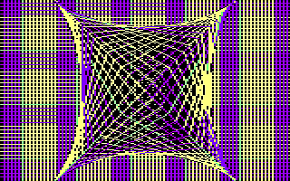

# CPCBasic Apps Collection

CPCBasicApps is a collection of CPC BASIC apps.
They can be run on a Amstrad CPC 464/664/6128, in an emulator or with
[CPCBasic](https://benchmarko.github.io/CPCBasic/cpcbasic.html).

Links:
[Source code](https://github.com/benchmarko/CPCBasicApps/),
[HTML Readme](https://github.com/benchmarko/CPCBasicApps/#readme),

The initial upload for a app should be in its "original" state.
After that it can be adapted to run with CPCBasic or other fast emulators.

## Some Demo Highlights

### 10 PRINT

[](https://benchmarko.github.io/CPCBasic/cpcbasic.html?database=apps&example=demo/10print)

Check [10print.org](https://10print.org/) and read the book!

CPC version of the program:

```bash
10 PRINT CHR$(199+2*RND);:FRAME:GOTO 10
```

### 100% BASIC Demo

[](https://benchmarko.github.io/CPCBasic/cpcbasic.html?database=apps&example=demo/100demo)
[](https://benchmarko.github.io/CPCBasic/cpcbasic.html?database=apps&example=demo/100demo)

Excellent BASIC demo by Markus Hohmann (Devilmarkus).

On a real CPC, the pre-calculation phase takes longer than 3 minutes. With CPCBasic you will ask, which pre-calculating phase?

### Graphics Demo 1 and 2

[](https://benchmarko.github.io/CPCBasic/cpcbasic.html?database=apps&example=demo/gdemo)
[](https://benchmarko.github.io/CPCBasic/cpcbasic.html?database=apps&example=demo/gdemo2)

Several nice graphics and animations. The original version uses assembler for sprite movements. CPCBasic is fast enough to do it all in BASIC.

### Schneider CPC 6128 Demo

[](https://benchmarko.github.io/CPCBasic/cpcbasic.html?database=apps&example=demo/scpc6128)
[](https://benchmarko.github.io/CPCBasic/cpcbasic.html?database=apps&example=demo/scpc6128)
(c) 1985 Schneider/Amstrad

The complete demo.

The [Can-Can sound](https://benchmarko.github.io/CPCBasic/cpcbasic.html?database=apps&example=music/cancan&sound=true) can also be played separately.

### British Council Tile Simulation

[](https://benchmarko.github.io/CPCBasic/cpcbasic.html?database=apps&example=demo/btilesim)
[](https://benchmarko.github.io/CPCBasic/cpcbasic.html?database=apps&example=demo/btilesim) (c) 2018 Rob Manuel

Check [Rob Manuel’s British Council Tile / Bus Fabric Sim](https://scruss.com/blog/2018/06/10/rob-manuels-british-council-tile-bus-fabric-sim/) on Stewart C. Russell's blog

### Mondrian

[](https://benchmarko.github.io/CPCBasic/cpcbasic.html?database=apps&example=demo/mondrian)

Check [The Joy of Programming: Mondrian Painting](https://www.youtube.com/watch?v=FUp3SffxPzw) and
[CPCwiki](https://www.cpcwiki.eu/forum/programming/mondrian-next-try-to-get-a-topic/)

## Some Games Highlights

### Card Games

[](https://benchmarko.github.io/CPCBasic/cpcbasic.html?database=apps&example=games/cards)

Some card games: Blackjack ("17 und 4") and Memory.

### Catch

[](https://benchmarko.github.io/CPCBasic/cpcbasic.html?database=apps&example=games/catch)

### Citylander

[](https://benchmarko.github.io/CPCBasic/cpcbasic.html?database=apps&example=games/cityland&sound=true) (c) 1985 Jujstronic Software

The tune [Fuer Elise](https://benchmarko.github.io/CPCBasic/cpcbasic.html?database=apps&example=music/elise&sound=true) by Ludwig van Beethoven can also be played separately.

### Clear Path

[](https://benchmarko.github.io/CPCBasic/cpcbasic.html?database=apps&example=games/clearpa&sound=true) (c) Peter Goode

A lander clone from [The Amstrad Program Book](https://archive.org/details/Amstrad_Program_Book_The_1984_Phoenix_Publishing_Associates/mode/2up) by Peter Goode, improved by [Im Wald](http://cpc-live.com/forum/index.php/topic,958.msg8133.html#msg8133).

### Garfunkel

[](https://benchmarko.github.io/CPCBasic/cpcbasic.html?database=apps&example=games/garfunkl&sound=true)
[](https://benchmarko.github.io/CPCBasic/cpcbasic.html?database=apps&example=games/garfunkl&sound=true) (c) Roland Bendig

### Sultan's Maze

[](https://benchmarko.github.io/CPCBasic/cpcbasic.html?database=apps&example=games/sultan&sound=true)
[](https://benchmarko.github.io/CPCBasic/cpcbasic.html?database=apps&example=games/sultan2&sound=true)
(c) 1984 Gem Software

On a real CPC, the game is rather slow, so I never played it. With CPCBasic it has a good speed now...

### Space Race

[](https://benchmarko.github.io/CPCBasic/cpcbasic.html?database=apps&example=games/spacera) (c) 1986 Peter Pekarek

### Space War

[](https://benchmarko.github.io/CPCBasic/cpcbasic.html?database=apps&example=games/spacewar)
[](https://benchmarko.github.io/CPCBasic/cpcbasic.html?database=apps&example=games/spacewar)

Minimalistic fun!

### Stardodger

[](https://benchmarko.github.io/CPCBasic/cpcbasic.html?database=apps&example=games/stardodg)
[](https://benchmarko.github.io/CPCBasic/cpcbasic.html?database=apps&example=games/stardodg) (c) Stewart C. Russell

Minimalistic fun! You really need the SPACE key only.

Check [2D Star Dodge flies again!](https://scruss.com/blog/2012/09/08/2d-star-dodge-flies-again/) on Stewart C. Russell's blog.

## Some 10-Liner Games

From the [BASIC 10-Liner Contest 2019](https://gkanold.wixsite.com/homeputerium/kopie-von-games-list-2019-2)

### CPCanabalt

[](https://benchmarko.github.io/CPCBasic/cpcbasic.html?database=apps&example=games/canabalt&sound=true) (c) Logiker

### Shielding Color

[](https://benchmarko.github.io/CPCBasic/cpcbasic.html?database=apps&example=games/scolor&sound=true) (c) Antonio "acorpascuenca" Corpas Cuenca

### Tanks Alot

[](https://benchmarko.github.io/CPCBasic/cpcbasic.html?database=apps&example=games/tanks&sound=true) (c) Ross "Out Bush" Simpson

## Some Music Highlights

### A small BASIC tune

[](https://benchmarko.github.io/CPCBasic/cpcbasic.html?database=apps&example=music/asbtune&sound=true) (c) Roald (Mr.Lou) Strauss

A fantastic tune! One of my favorites.

### Axel F

[](https://benchmarko.github.io/CPCBasic/cpcbasic.html?database=apps&example=music/axelf&sound=true)

### Bach

[](https://benchmarko.github.io/CPCBasic/cpcbasic.html?database=apps&example=music/bach&sound=true)

Johann Sebastian Bach: "Wohl mir,dass ich Jesum habe"

### Elise

[](https://benchmarko.github.io/CPCBasic/cpcbasic.html?database=apps&example=music/elise&sound=true)

"Fuer Elise" by Ludwig van Beethoven. Taken from the game Citylander by Jujstronic Software.

### Rocking CPC

[](https://benchmarko.github.io/CPCBasic/cpcbasic.html?database=apps&example=music/rocking&sound=true) (c) Manfred Lipowski

### Tico Tico

[](https://benchmarko.github.io/CPCBasic/cpcbasic.html?database=apps&example=music/ticotico&sound=true)

## Some BasiCode programs

These programs use the [BasiCode](https://benchmarko.github.io/CPCBasic/cpcbasic.html?database=apps&example=basicode/basicode) library which allows to write BASIC programs which run on systems with different BASIC dialects.
Check the [BasiCode](https://www.basicode.de/) page by Thomas Rademacher.
There is also an excellent [BASICODE Interpreter](https://robhagemans.github.io/basicode/) by Rob Hagemans. It runs in the browser and has a lot of sample programs.

### Countries

[](https://benchmarko.github.io/CPCBasic/cpcbasic.html?database=apps&example=basicode/countries) (c) J van Noort

Information about 178 countries in Dutch language.

### Doctor

[](https://benchmarko.github.io/CPCBasic/cpcbasic.html?database=apps&example=basicode/doctor) (c) Andreas Garten

Ask the doctor ("Der kleine Hausarzt") in German language.

### Ellipses

[](https://benchmarko.github.io/CPCBasic/cpcbasic.html?database=apps&example=basicode/ellipses) (c) Jaap Wieles

### Friendship

[](https://benchmarko.github.io/CPCBasic/cpcbasic.html?database=apps&example=basicode/friendsh&sound=true) (c) Walther van den Elshout / Detlev Winkel

### Impossible Figures

[](https://benchmarko.github.io/CPCBasic/cpcbasic.html?database=apps&example=basicode/imposfig) (c) Thomas Schäfer

### Nonius

[](https://benchmarko.github.io/CPCBasic/cpcbasic.html?database=apps&example=basicode/nonius) (c) H.J. Pootjes

Do you know how to use a Vernier scale? With this program you can practice it. Explanations are in Dutch language.

### Tennis

[](https://benchmarko.github.io/CPCBasic/cpcbasic.html?database=apps&example=basicode/tennis) (c) Abdon Pijpelink

## Misc

...and a lot more to explore which is not (yet) listed here.

If you improve some of the programs, please send me an update. Or upload them to GitHub. Also, if you want to include some new programs...

--

### **mv, 03/2020**
