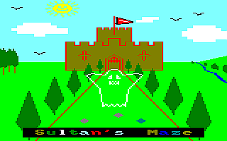

# CPCBasic Apps Collection

CPCBasicApps is a collection of CPC BASIC apps.
They can be run on a Amstrad CPC 464/664/6128, in an emulator or with
[CPCBasic](https://benchmarko.github.io/CPCBasic/) or [CPCBasicTS](https://benchmarko.github.io/CPCBasicTS/).

Links:
[Source code](https://github.com/benchmarko/CPCBasicApps/),
[HTML Readme](https://github.com/benchmarko/CPCBasicApps/#readme),

The initial upload for a app should be in its "original" state.
After that it can be adapted to run with CPCBasic, CPCBasicTS or other fast emulators.

## Some Demo Highlights

### 10 PRINT

[](https://benchmarko.github.io/CPCBasic/index.html?database=apps&example=demo/10print)

Check [10print.org](https://10print.org/) and read the book!

CPC version of the program:

```bash
10 PRINT CHR$(199+2*RND);:FRAME:GOTO 10
```

### 100% BASIC Demo

[](https://benchmarko.github.io/CPCBasic/index.html?database=apps&example=demo/100demo)
[](https://benchmarko.github.io/CPCBasic/index.html?database=apps&example=demo/100demo&input=%0d) (c) Markus Hohmann

Excellent BASIC demo.

On a real CPC, the pre-calculation phase takes longer than 3 minutes. With CPCBasic you will ask, which pre-calculating phase?

### Amstrad CPC 6128 Demo

[](https://benchmarko.github.io/CPCBasic/index.html?database=apps&example=demo/acpc6128)
[](https://benchmarko.github.io/CPCBasic/index.html?database=apps&example=demo/acpc6128) (c) Amstrad, 1985

### Art: Screens Unlimited

[](https://benchmarko.github.io/CPCBasic/index.html?database=apps&example=demo/art&input=11)
[](https://benchmarko.github.io/CPCBasic/index.html?database=apps&example=demo/art&input=2) (c)

Nice landscapes.

### ASCII Art

[](https://benchmarko.github.io/CPCBasic/index.html?database=apps&example=demo/asciiart) (c)

### BASIC World

[](https://benchmarko.github.io/CPCBasic/index.html?database=apps&example=demo/basworld) (c) Roald (Mr.Lou) Strauss

Title screen of an unfinished game with a nice tune.

### Boogle

[](https://benchmarko.github.io/CPCBasic/index.html?database=apps&example=demo/boogle) (c)

### British Council Tile Simulation

[](https://benchmarko.github.io/CPCBasic/index.html?database=apps&example=demo/btilesim)
[](https://benchmarko.github.io/CPCBasic/index.html?database=apps&example=demo/btilesim) (c) Rob Manuel, 2018

Check [Rob Manuel’s British Council Tile / Bus Fabric Sim](https://scruss.com/blog/2018/06/10/rob-manuels-british-council-tile-bus-fabric-sim/) on Stewart C. Russell's blog.

### Circle Writer

[](https://benchmarko.github.io/CPCBasic/index.html?database=apps&example=demo/circlewr) (c) COMTEC, 19xx

### Flags

[](https://benchmarko.github.io/CPCBasic/index.html?database=apps&example=demo/flags&input=1%0d)
[](https://benchmarko.github.io/CPCBasic/index.html?database=apps&example=demo/flags&input=2%0d) (c) Richard Fairhurst

### Graphics Demo 1

[](https://benchmarko.github.io/CPCBasic/index.html?database=apps&example=demo/gdemo&input=A)
[](https://benchmarko.github.io/CPCBasic/index.html?database=apps&example=demo/gdemo&input=E) (c)

Several nice graphics and animations, some with morphing effects. The original version uses assembler for sprite movements. CPCBasic is fast enough to do it all in BASIC.
Here we have "Windows" and "Pac-Man".

### Graphics Demo 2

[](https://benchmarko.github.io/CPCBasic/index.html?database=apps&example=demo/gdemo2&input=C)
[](https://benchmarko.github.io/CPCBasic/index.html?database=apps&example=demo/gdemo2&input=F) (c)

Some more nice graphics and animations, mainly done by changing colors.
Here we have "Blinker" and "R2D2".

### Grafix Demo

[](https://benchmarko.github.io/CPCBasic/index.html?database=apps&example=demo/grafix)
[](https://benchmarko.github.io/CPCBasic/index.html?database=apps&example=demo/grafix) (c) Dino, 1990

### House for Sale

[](https://benchmarko.github.io/CPCBasic/index.html?database=apps&example=demo/house) (c) Simon Baker, Kevin Parker, 1991

Just 9 lines of code, adapted for CPC 464 (no *FILL* command) by Out Bush.
Check the blog [FILLing them Ol'​ BASIC 10-Liners on a 464](https://www.linkedin.com/pulse/filling-them-ol-basic-10-liners-464-out-bush/).

### ISG Demo

[](https://benchmarko.github.io/CPCBasic/index.html?database=apps&example=demo/isgdemo) (c) Günter Woigk, 1986

Interrupt & Sound & Grafik (ISG) Demo

### Mondrian

[](https://benchmarko.github.io/CPCBasic/index.html?database=apps&example=demo/mondrian) (c) Out Bush, 2019

An improved version that creates more Mondrian-like paintings. For details, check the [CPCwiki](https://www.cpcwiki.eu/forum/programming/mondrian-next-try-to-get-a-topic/). The first version by SRS is based on [The Joy of Programming: Mondrian Painting](https://www.youtube.com/watch?v=FUp3SffxPzw).

### No Smoking (Screen)

[](https://benchmarko.github.io/CPCBasic/index.html?database=apps&example=demo/nosmoke) (c)

### Popsi (Screen)

[](https://benchmarko.github.io/CPCBasic/index.html?database=apps&example=demo/popsi) (c)

### Ray Eclipse

[](https://benchmarko.github.io/CPCBasic/index.html?database=apps&example=demo/rayclip) (c) Alan Scully

### Schneider CPC 6128 Demo

[](https://benchmarko.github.io/CPCBasic/index.html?database=apps&example=demo/scpc6128)
[](https://benchmarko.github.io/CPCBasic/index.html?database=apps&example=demo/scpc6128)
(c) Schneider/Amstrad, 1985

The complete demo. Additional data file for Schneider logo: scpc6128.dat.

The [Can-Can sound](https://benchmarko.github.io/CPCBasic/index.html?database=apps&example=music/cancan) can also be played separately.

### Serpent

[](https://benchmarko.github.io/CPCBasic/index.html?database=apps&example=demo/serpent) (c) T Magee, 1987

## Some Games Highlights

### BASIC Game 2

[](https://benchmarko.github.io/CPCBasic/index.html?database=apps&example=games/basgame2) (c) Roald (Mr.Lou) Strauss

Unfinished BASIC game 2.

### Canyons of Cannons

[](https://benchmarko.github.io/CPCBasic/index.html?database=apps&example=games/canyons) (c) Ingo Pax, 1985

### Car Drive (Autofahren)

[](https://benchmarko.github.io/CPCBasic/index.html?database=apps&example=games/cardrive) (c)

### Card Games

[](https://benchmarko.github.io/CPCBasic/index.html?database=apps&example=games/cards) (c)

Some card games: Blackjack ("17 und 4") and Memory.

### Catch

[](https://benchmarko.github.io/CPCBasic/index.html?database=apps&example=games/catch) (c) PC Amstrad International, 1990

### Citylander

[](https://benchmarko.github.io/CPCBasic/index.html?database=apps&example=games/cityland) (c) Jujstronic Software, 1985

The tune [Fuer Elise](https://benchmarko.github.io/CPCBasic/index.html?database=apps&example=music/elise) by Ludwig van Beethoven can also be played separately.

### Clear Path

[](https://benchmarko.github.io/CPCBasic/index.html?database=apps&example=games/clearpa) (c) Peter Goode, 1984

A lander clone from [The Amstrad Program Book](https://archive.org/details/Amstrad_Program_Book_The_1984_Phoenix_Publishing_Associates/mode/2up) by Peter Goode, improved by [Im Wald](http://cpc-live.com/forum/index.php/topic,958.msg8133.html#msg8133).

### Connect 4 (Tower: 4 Gewinnt)

[](https://benchmarko.github.io/CPCBasic/index.html?database=apps&example=games/connect4)
[](https://benchmarko.github.io/CPCBasic/index.html?database=apps&example=games/connect4&input=%0d2330) (c) O. Zabel

### Copter Patrol

[](https://benchmarko.github.io/CPCBasic/index.html?database=apps&example=games/copter)
[](https://benchmarko.github.io/CPCBasic/index.html?database=apps&example=games/copter&input=%20me%0d%0d%20) (c) Christian Moeller, 1985

### CPCanabalt

[](https://benchmarko.github.io/CPCBasic/index.html?database=apps&example=games/canabalt) (c) Logiker, 2019

From the [BASIC 10-Liner Contest 2019](https://gkanold.wixsite.com/homeputerium/kopie-von-games-list-2019-2).

### Crib (Cribbage v1)

[](https://benchmarko.github.io/CPCBasic/index.html?database=apps&example=games/crib) (c)

### Cribbage (v2)

[](https://benchmarko.github.io/CPCBasic/index.html?database=apps&example=games/cribbage) (c) Nick Herrick, 1986

### Duel

[](https://benchmarko.github.io/CPCBasic/index.html?database=apps&example=games/duel) (c) Bernhard Morell

### Dambusters

[](https://benchmarko.github.io/CPCBasic/index.html?database=apps&example=games/dambust)
[](https://benchmarko.github.io/CPCBasic/index.html?database=apps&example=games/dambust) (c) Paul Stanley, 1984


### Emperor (Kaiser)

[](https://benchmarko.github.io/CPCBasic/index.html?database=apps&example=games/emperor) (c)

To select an action during the game, use joystick or numpad numbers.

### Garfunkel

[](https://benchmarko.github.io/CPCBasic/index.html?database=apps&example=games/garfunkl)
[](https://benchmarko.github.io/CPCBasic/index.html?database=apps&example=games/garfunkl) (c) Roland Bendig, 1987

### Goldrush (Goldrausch)

[](https://benchmarko.github.io/CPCBasic/index.html?database=apps&example=games/goldrush)
[](https://benchmarko.github.io/CPCBasic/index.html?database=apps&example=games/goldrush) (c) Jörg Walkowiak, 1984

### Inka Sogra

[](https://benchmarko.github.io/CPCBasic/index.html?database=apps&example=games/inka)
[](https://benchmarko.github.io/CPCBasic/index.html?database=apps&example=games/inka) (c) F. Meurer

### Jack-Pot

[](https://benchmarko.github.io/CPCBasic/index.html?database=apps&example=games/jackpot) (c) Jean-François SEHAN, 1985

### Klondike

[](https://benchmarko.github.io/CPCBasic/index.html?database=apps&example=games/klondike) (c)

### Lander

[](https://benchmarko.github.io/CPCBasic/index.html?database=apps&example=games/lander)
[](https://benchmarko.github.io/CPCBasic/index.html?database=apps&example=games/lander) (c) Georg Huonker, 1985

### Maze

[](https://benchmarko.github.io/CPCBasic/index.html?database=apps&example=games/maze)
[](https://benchmarko.github.io/CPCBasic/index.html?database=apps&example=games/maze) (c) Joerg Heise

### Mini Chess

[](https://benchmarko.github.io/CPCBasic/index.html?database=apps&example=games/mchess) (c) Matthias Uphoff, 1986

Additional file with learned positions: mchess.dat.
German Documentation can be found at [Software Experiment 6](http://cpctech.cpc-live.com/docs/dse/softex06.html).

### Patience: The Card Game

[](https://benchmarko.github.io/CPCBasic/index.html?database=apps&example=games/patience)
[](https://benchmarko.github.io/CPCBasic/index.html?database=apps&example=games/patience) (c) Clive Blackmore

### President (Praesident)

[](https://benchmarko.github.io/CPCBasic/index.html?database=apps&example=games/preside) (c)

### Rogue Descender

[](https://benchmarko.github.io/CPCBasic/index.html?database=apps&example=games/roguedes) (c) Graham Briggs

BASIC 10-liner.

### Shielding Color

[](https://benchmarko.github.io/CPCBasic/index.html?database=apps&example=games/scolor) (c) Antonio "acorpascuenca" Corpas Cuenca, 2019

From the [BASIC 10-Liner Contest 2019](https://gkanold.wixsite.com/homeputerium/kopie-von-games-list-2019-2).

### Solitair

[](https://benchmarko.github.io/CPCBasic/index.html?database=apps&example=games/solitair) (c) Uwe Ganter, 1985

### Space Race

[](https://benchmarko.github.io/CPCBasic/index.html?database=apps&example=games/spacera)
[](https://benchmarko.github.io/CPCBasic/index.html?database=apps&example=games/spacera) (c) Peter Pekarek, 1986

### Space Base

[](https://benchmarko.github.io/CPCBasic/index.html?database=apps&example=games/spaceba)
[](https://benchmarko.github.io/CPCBasic/index.html?database=apps&example=games/spaceba) (c) Robin Nixon, 1986

### Space War

[](https://benchmarko.github.io/CPCBasic/index.html?database=apps&example=games/spacewar)
[](https://benchmarko.github.io/CPCBasic/index.html?database=apps&example=games/spacewar) (c) Daniel Flower

Minimalistic fun!

### Stardodger

[](https://benchmarko.github.io/CPCBasic/index.html?database=apps&example=games/stardodg)
[](https://benchmarko.github.io/CPCBasic/index.html?database=apps&example=games/stardodg) (c) Stewart C. Russell

Minimalistic fun! You really need the SPACE key only.

Check [2D Star Dodge flies again!](https://scruss.com/blog/2012/09/08/2d-star-dodge-flies-again/) on Stewart C. Russell's blog.

### Sultan's Maze

[](https://benchmarko.github.io/CPCBasic/index.html?database=apps&example=games/sultan)
[](https://benchmarko.github.io/CPCBasic/index.html?database=apps&example=games/sultan2)
(c) Gem Software, 1984

On a real CPC, the game is rather slow, so I never played it. With CPCBasic it has a good speed now.

### Sunburst Contamination

[](https://benchmarko.github.io/CPCBasic/index.html?database=apps&example=games/sunburst) (c)

### Tanks Alot

[](https://benchmarko.github.io/CPCBasic/index.html?database=apps&example=games/tanks) (c) Ross "Out Bush" Simpson, 2019

From the [BASIC 10-Liner Contest 2019](https://gkanold.wixsite.com/homeputerium/kopie-von-games-list-2019-2).

### Titan

[](https://benchmarko.github.io/CPCBasic/index.html?database=apps&example=games/titan)
[](https://benchmarko.github.io/CPCBasic/index.html?database=apps&example=games/titan)
(c) MS-Software, 1985

### Tower of Hanoi (Türme von Hanoi; Pagoden von Peking)

[](https://benchmarko.github.io/CPCBasic/index.html?database=apps&example=games/tower)
[](https://benchmarko.github.io/CPCBasic/index.html?database=apps&example=games/tower) (c)

### Yahtzee (Kniffel)

[](https://benchmarko.github.io/CPCBasic/index.html?database=apps&example=games/yahtzee)
[](https://benchmarko.github.io/CPCBasic/index.html?database=apps&example=games/yahtzee) (c) J. E. Muschik, 1985

### Yahtzee 2 (Kniffel)

[](https://benchmarko.github.io/CPCBasic/index.html?database=apps&example=games/yahtzee2)
[](https://benchmarko.github.io/CPCBasic/index.html?database=apps&example=games/yahtzee2) (c) Veb Mikroelektronik Muehlhausen

This version is based on Yahtzee 1 and uses MODE 1 and BASIC 1.1

## Some Apps Highlights

### Amsynthé

[](https://benchmarko.github.io/CPCBasic/index.html?database=apps&example=apps/amsynthe) (c) Hebdogiciel, 1986

### CPC Doodle

[](https://benchmarko.github.io/CPCBasic/index.html?database=apps&example=apps/doodle/doodle)
[](https://benchmarko.github.io/CPCBasic/index.html?database=apps&example=apps/doodle/doodle&input=nl2cv%0d) (c) Markus Hohmann, 2018

Additional files: Three example drawings 2cv.drw, doodle.drw and mallet.drw.

### Lifespan (Lebenserwartung)

[](https://benchmarko.github.io/CPCBasic/index.html?database=apps&example=apps/lifespan) (c)

### Multitext CPC

[](https://benchmarko.github.io/CPCBasic/index.html?database=apps&example=apps/mtext)
[](https://benchmarko.github.io/CPCBasic/index.html?database=apps&example=apps/mtext) (c) Rainbow Arts, 1985

### Sayit (Sag's)

[](https://benchmarko.github.io/CPCBasic/index.html?database=apps&example=apps/sayit) (c) Wolfgang Rauneker, 1986

Write a number in English, German or Bavarian

### Symbol Generator

[](https://benchmarko.github.io/CPCBasic/index.html?database=apps&example=apps/sygen) (c) SkulleateR

## Tarot Reader

[](https://benchmarko.github.io/CPCBasic/index.html?database=apps&example=apps/tarot) (c) TODO

### Time Tester

[](https://benchmarko.github.io/CPCBasic/index.html?database=apps&example=apps/timetest)
[](https://benchmarko.github.io/CPCBasic/index.html?database=apps&example=apps/timetest) (c)

## Some Music Highlights

### A small BASIC tune

[](https://benchmarko.github.io/CPCBasic/index.html?database=apps&example=music/asbtune) (c) Roald (Mr.Lou) Strauss, 2018

A fantastic tune! One of my favorites.

### Axel F

[](https://benchmarko.github.io/CPCBasic/index.html?database=apps&example=music/axelf) by Harold Faltermeyer

### Bach

[](https://benchmarko.github.io/CPCBasic/index.html?database=apps&example=music/bach) (c) Wolfgang Volz

Johann Sebastian Bach: "Wohl mir,dass ich Jesum habe"

### Cancan

[](https://benchmarko.github.io/CPCBasic/index.html?database=apps&example=music/cancan)

Can Can (Infernal Galop) by Jacques Offenbach.
The Schneider CPC 6128 Demo Music.

### Clarinet

[](https://benchmarko.github.io/CPCBasic/index.html?database=apps&example=music/clarinet) (c) Juergen Werner

Clarinet (Klarinettenmuck'l, Jaroslav Skabrada)

### CPC Organ

[](https://benchmarko.github.io/CPCBasic/index.html?database=apps&example=music/cpcorgan)
[](https://benchmarko.github.io/CPCBasic/index.html?database=apps&example=music/cpcorgan) (c) Oliver Heggelbacher

CPC Organ (CPC-Orgel) (an app)

### Elise

[](https://benchmarko.github.io/CPCBasic/index.html?database=apps&example=music/elise) (c) Jujstronic Software, 1985

"Fuer Elise" by Ludwig van Beethoven. Taken from the game Citylander by Jujstronic Software. I have optimized the code a bit.

### Menuett

[](https://benchmarko.github.io/CPCBasic/index.html?database=apps&example=music/menuett) (c) mIC-Software

Menuett (Minuet) by James Hook

### Mexicana

[](https://benchmarko.github.io/CPCBasic/index.html?database=apps&example=music/mexicana) (c) Juergen Werner

Dance Mexicana (Jarabe Tapatio, Mexican Hat Dance)

### Rocking CPC

[](https://benchmarko.github.io/CPCBasic/index.html?database=apps&example=music/rocking) (c) Manfred Lipowski, 1987

### Roxette

[](https://benchmarko.github.io/CPCBasic/index.html?database=apps&example=music/roxette) (c) Roald (Mr.Lou) Strauss

Roxette: Listen To Your Heart

### Tico Tico

[](https://benchmarko.github.io/CPCBasic/index.html?database=apps&example=music/ticotico)

### Touch

[](https://benchmarko.github.io/CPCBasic/index.html?database=apps&example=music/touch) (c) Roald (Mr.Lou) Strauss

U Can't Touch This (MC Hammer)

### (Test) Separate Music Readme

[Music collection](./apps/music/README.md)

## Some BasiCode programs

These programs use the [BasiCode](https://benchmarko.github.io/CPCBasic/index.html?database=apps&example=basicode/basicode) library which allows to write BASIC programs which run on systems with different BASIC dialects.
Check the [BasiCode](http://www.basicode.de/) page by Thomas Rademacher.
There is a is a tutorial with PDF documentation in  [BC3 Kurs](http://www.basicode.de/download/BC3_KURS.zip).

There is also an excellent [BASICODE Interpreter](https://robhagemans.github.io/basicode/) by Rob Hagemans. It runs in the browser and has a lot of sample programs.

### BC Help (BC Hilfe)

[](https://benchmarko.github.io/CPCBasic/index.html?database=apps&example=basicode/bchelp) (c) Hannes Frank

### Countries

[](https://benchmarko.github.io/CPCBasic/index.html?database=apps&example=basicode/countries) (c) J van Noort, 1989

Information about 178 countries in Dutch language.

### Doctor

[](https://benchmarko.github.io/CPCBasic/index.html?database=apps&example=basicode/doctor) (c) Andreas Garten, 1991

Ask the doctor ("Der kleine Hausarzt") in German language.

### Ellipses

[](https://benchmarko.github.io/CPCBasic/index.html?database=apps&example=basicode/ellipses)
[](https://benchmarko.github.io/CPCBasic/index.html?database=apps&example=basicode/ellipses) (c) Jaap Wieles

### Figures

[](https://benchmarko.github.io/CPCBasic/index.html?database=apps&example=basicode/figures)
[](https://benchmarko.github.io/CPCBasic/index.html?database=apps&example=basicode/figures) (c) Roland van Vugt, 1986

### Friendship

[](https://benchmarko.github.io/CPCBasic/index.html?database=apps&example=basicode/friendsh) (c) Walther van den Elshout / Detlev Winkel, 1991

### Function Plotting

[](https://benchmarko.github.io/CPCBasic/index.html?database=apps&example=basicode/funcplot) (c) Hannes Frank

### Impossible Figures

[](https://benchmarko.github.io/CPCBasic/index.html?database=apps&example=basicode/imposfig)
[](https://benchmarko.github.io/CPCBasic/index.html?database=apps&example=basicode/imposfig) (c) Thomas Schäfer, 1991

### Nonius

[](https://benchmarko.github.io/CPCBasic/index.html?database=apps&example=basicode/nonius) (c) H.J. Pootjes, 1990

Do you know how to use a Vernier scale? With this program you can practice it. Explanations are in Dutch language.

### Reaction

[](https://benchmarko.github.io/CPCBasic/index.html?database=apps&example=basicode/reaction) (c) Ch.W. Brederode, 1989

Translated by Ronald Knak.

### Rotation

[](https://benchmarko.github.io/CPCBasic/index.html?database=apps&example=basicode/rotation) (c) Thomas Rademacher, 2003

### RSA 1, 2, 3

[](https://benchmarko.github.io/CPCBasic/index.html?database=apps&example=basicode/rsa1) (c) Friedrich Dormeier, 1991

- [RSA 1](https://benchmarko.github.io/CPCBasic/index.html?database=apps&example=basicode/rsa1)
- [RSA 2](https://benchmarko.github.io/CPCBasic/index.html?database=apps&example=basicode/rsa2)
- [RSA 3](https://benchmarko.github.io/CPCBasic/index.html?database=apps&example=basicode/rsa3)

### Tennis

[](https://benchmarko.github.io/CPCBasic/index.html?database=apps&example=basicode/tennis) (c) Abdon Pijpelink

### Typen

[](https://benchmarko.github.io/CPCBasic/index.html?database=apps&example=basicode/typen)
[](https://benchmarko.github.io/CPCBasic/index.html?database=apps&example=basicode/typen) (c) Rene Derkx, 1990

## Misc

If you improve some of the programs, please send me an update. Or upload them to GitHub. Also, if you want to include some new programs...

## Links

- [A collection of BASICODE programs by various authors](https://github.com/robhagemans/basicode)

### **mv, 09/2022**
