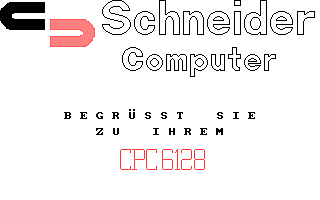

# CPCBasic Apps Collection

CPCBasicApps is a collection of CPC BASIC apps.
They can be run on a Amstrad CPC 464/664/6128, in an emulator or with
[CPCBasic](https://benchmarko.github.io/CPCBasic/cpcbasic.html).

Links:
[Source code](https://github.com/benchmarko/CPCBasicApps/),
[HTML Readme](https://github.com/benchmarko/CPCBasicApps/#readme),

The initial upload for a app should be in its "original" state.
After that it can be adapted to run with CPCBasic or other fast emulators.

## Some Demo Highlights

### 10 PRINT

[](https://benchmarko.github.io/CPCBasic/cpcbasic.html?database=apps&example=demo/10print)

Check [10print.org](https://10print.org/) and read the book!

CPC version of the program:

```bash
10 PRINT CHR$(199+2*RND);:FRAME:GOTO 10
```

### 100% BASIC Demo

[](https://benchmarko.github.io/CPCBasic/cpcbasic.html?database=apps&example=demo/100demo)
[](https://benchmarko.github.io/CPCBasic/cpcbasic.html?database=apps&example=demo/100demo) (c) Markus Hohmann (Devilmarkus)

Excellent BASIC demo.

On a real CPC, the pre-calculation phase takes longer than 3 minutes. With CPCBasic you will ask, which pre-calculating phase?

### Graphics Demo 1

[](https://benchmarko.github.io/CPCBasic/cpcbasic.html?database=apps&example=demo/gdemo)
[](https://benchmarko.github.io/CPCBasic/cpcbasic.html?database=apps&example=demo/gdemo) "Windows" and "Pac-Man"

Several nice graphics and animations, some with morphing effects. The original version uses assembler for sprite movements. CPCBasic is fast enough to do it all in BASIC.

### Graphics Demo 2

[](https://benchmarko.github.io/CPCBasic/cpcbasic.html?database=apps&example=demo/gdemo2)
[](https://benchmarko.github.io/CPCBasic/cpcbasic.html?database=apps&example=demo/gdemo2) "Blinker" and "R2D2"

Some more nice graphics and animations, mainly done by changing colors.

### Schneider CPC 6128 Demo

[](https://benchmarko.github.io/CPCBasic/cpcbasic.html?database=apps&example=demo/scpc6128)
[](https://benchmarko.github.io/CPCBasic/cpcbasic.html?database=apps&example=demo/scpc6128)
(c) Schneider/Amstrad, 1985

The complete demo.

The [Can-Can sound](https://benchmarko.github.io/CPCBasic/cpcbasic.html?database=apps&example=music/cancan&sound=true) can also be played separately.

### House for Sale

[](https://benchmarko.github.io/CPCBasic/cpcbasic.html?database=apps&example=demo/house&sound=true) (c) Simon Baker, Kevin Parker, 1991

Just 9 lines of code, adapted for CPC 464 (no *FILL* command) by Out Bush.
Check the blog [FILLing them Ol'​ BASIC 10-Liners on a 464](https://www.linkedin.com/pulse/filling-them-ol-basic-10-liners-464-out-bush/).

### British Council Tile Simulation

[](https://benchmarko.github.io/CPCBasic/cpcbasic.html?database=apps&example=demo/btilesim)
[](https://benchmarko.github.io/CPCBasic/cpcbasic.html?database=apps&example=demo/btilesim) (c) Rob Manuel, 2018

Check [Rob Manuel’s British Council Tile / Bus Fabric Sim](https://scruss.com/blog/2018/06/10/rob-manuels-british-council-tile-bus-fabric-sim/) on Stewart C. Russell's blog.

### Mondrian

[](https://benchmarko.github.io/CPCBasic/cpcbasic.html?database=apps&example=demo/mondrian) (c) SRS, 2019

Check [The Joy of Programming: Mondrian Painting](https://www.youtube.com/watch?v=FUp3SffxPzw) and
[CPCwiki](https://www.cpcwiki.eu/forum/programming/mondrian-next-try-to-get-a-topic/)

## Some Games Highlights

### Card Games

[](https://benchmarko.github.io/CPCBasic/cpcbasic.html?database=apps&example=games/cards)

Some card games: Blackjack ("17 und 4") and Memory.

### Catch

[](https://benchmarko.github.io/CPCBasic/cpcbasic.html?database=apps&example=games/catch) (c) PC Amstrad International, 1990

### Citylander

[](https://benchmarko.github.io/CPCBasic/cpcbasic.html?database=apps&example=games/cityland&sound=true) (c) Jujstronic Software, 1985

The tune [Fuer Elise](https://benchmarko.github.io/CPCBasic/cpcbasic.html?database=apps&example=music/elise&sound=true) by Ludwig van Beethoven can also be played separately.

### Clear Path

[](https://benchmarko.github.io/CPCBasic/cpcbasic.html?database=apps&example=games/clearpa&sound=true) (c) Peter Goode, 1984

A lander clone from [The Amstrad Program Book](https://archive.org/details/Amstrad_Program_Book_The_1984_Phoenix_Publishing_Associates/mode/2up) by Peter Goode, improved by [Im Wald](http://cpc-live.com/forum/index.php/topic,958.msg8133.html#msg8133).

### Garfunkel

[](https://benchmarko.github.io/CPCBasic/cpcbasic.html?database=apps&example=games/garfunkl&sound=true)
[](https://benchmarko.github.io/CPCBasic/cpcbasic.html?database=apps&example=games/garfunkl&sound=true) (c) Roland Bendig, 1987

### Sultan's Maze

[](https://benchmarko.github.io/CPCBasic/cpcbasic.html?database=apps&example=games/sultan&sound=true)
[](https://benchmarko.github.io/CPCBasic/cpcbasic.html?database=apps&example=games/sultan2&sound=true)
(c) Gem Software, 1984

On a real CPC, the game is rather slow, so I never played it. With CPCBasic it has a good speed now...

### Space Race

[](https://benchmarko.github.io/CPCBasic/cpcbasic.html?database=apps&example=games/spacera) (c) Peter Pekarek, 1986

### Space War

[](https://benchmarko.github.io/CPCBasic/cpcbasic.html?database=apps&example=games/spacewar)
[](https://benchmarko.github.io/CPCBasic/cpcbasic.html?database=apps&example=games/spacewar) (c) Daniel Flower

Minimalistic fun!

### Stardodger

[](https://benchmarko.github.io/CPCBasic/cpcbasic.html?database=apps&example=games/stardodg)
[](https://benchmarko.github.io/CPCBasic/cpcbasic.html?database=apps&example=games/stardodg) (c) Stewart C. Russell

Minimalistic fun! You really need the SPACE key only.

Check [2D Star Dodge flies again!](https://scruss.com/blog/2012/09/08/2d-star-dodge-flies-again/) on Stewart C. Russell's blog.

## Some 10-Liner Games

From the [BASIC 10-Liner Contest 2019](https://gkanold.wixsite.com/homeputerium/kopie-von-games-list-2019-2)

### CPCanabalt

[](https://benchmarko.github.io/CPCBasic/cpcbasic.html?database=apps&example=games/canabalt&sound=true) (c) Logiker, 2019

### Shielding Color

[](https://benchmarko.github.io/CPCBasic/cpcbasic.html?database=apps&example=games/scolor&sound=true) (c) Antonio "acorpascuenca" Corpas Cuenca, 2019

### Tanks Alot

[](https://benchmarko.github.io/CPCBasic/cpcbasic.html?database=apps&example=games/tanks&sound=true) (c) Ross "Out Bush" Simpson, 2019

## Some Music Highlights

### A small BASIC tune

[](https://benchmarko.github.io/CPCBasic/cpcbasic.html?database=apps&example=music/asbtune&sound=true) (c) Roald (Mr.Lou) Strauss, 2018

A fantastic tune! One of my favorites.

### Axel F

[](https://benchmarko.github.io/CPCBasic/cpcbasic.html?database=apps&example=music/axelf&sound=true) by Harold Faltermeyer

### Bach

[](https://benchmarko.github.io/CPCBasic/cpcbasic.html?database=apps&example=music/bach&sound=true) (c) Wolfgang Volz

Johann Sebastian Bach: "Wohl mir,dass ich Jesum habe"

### Elise

[](https://benchmarko.github.io/CPCBasic/cpcbasic.html?database=apps&example=music/elise&sound=true) (c) Jujstronic Software, 1985

"Fuer Elise" by Ludwig van Beethoven. Taken from the game Citylander by Jujstronic Software. I have optimized the code a bit.

### Rocking CPC

[](https://benchmarko.github.io/CPCBasic/cpcbasic.html?database=apps&example=music/rocking&sound=true) (c) Manfred Lipowski, 1987

### Tico Tico

[](https://benchmarko.github.io/CPCBasic/cpcbasic.html?database=apps&example=music/ticotico&sound=true)

## Some BasiCode programs

These programs use the [BasiCode](https://benchmarko.github.io/CPCBasic/cpcbasic.html?database=apps&example=basicode/basicode) library which allows to write BASIC programs which run on systems with different BASIC dialects.
Check the [BasiCode](https://www.basicode.de/) page by Thomas Rademacher.
There is also an excellent [BASICODE Interpreter](https://robhagemans.github.io/basicode/) by Rob Hagemans. It runs in the browser and has a lot of sample programs.

### Countries

[](https://benchmarko.github.io/CPCBasic/cpcbasic.html?database=apps&example=basicode/countries) (c) J van Noort, 1989

Information about 178 countries in Dutch language.

### Doctor

[](https://benchmarko.github.io/CPCBasic/cpcbasic.html?database=apps&example=basicode/doctor) (c) Andreas Garten, 1991

Ask the doctor ("Der kleine Hausarzt") in German language.

### Ellipses

[](https://benchmarko.github.io/CPCBasic/cpcbasic.html?database=apps&example=basicode/ellipses) (c) Jaap Wieles

### Friendship

[](https://benchmarko.github.io/CPCBasic/cpcbasic.html?database=apps&example=basicode/friendsh&sound=true) (c) Walther van den Elshout / Detlev Winkel, 1991

### Impossible Figures

[](https://benchmarko.github.io/CPCBasic/cpcbasic.html?database=apps&example=basicode/imposfig) (c) Thomas Schäfer, 1991

### Nonius

[](https://benchmarko.github.io/CPCBasic/cpcbasic.html?database=apps&example=basicode/nonius) (c) H.J. Pootjes, 1990

Do you know how to use a Vernier scale? With this program you can practice it. Explanations are in Dutch language.

### Tennis

[](https://benchmarko.github.io/CPCBasic/cpcbasic.html?database=apps&example=basicode/tennis) (c) Abdon Pijpelink

## Misc

...and a lot more to explore which is not (yet) listed here.

If you improve some of the programs, please send me an update. Or upload them to GitHub. Also, if you want to include some new programs...

--

### **mv, 04/2020**
