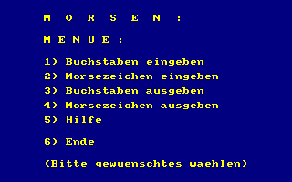

# CPCBasic Apps Collection (Apps)

CPCBasicApps is a collection of CPC BASIC apps.
They can be run on a Amstrad CPC 464/664/6128, in an emulator or with
[CPCBasic](https://benchmarko.github.io/CPCBasic/) or [CPCBasicTS](https://benchmarko.github.io/CPCBasicTS/).

Links:
[Source code](https://github.com/benchmarko/CPCBasicApps/),
[HTML Readme](https://github.com/benchmarko/CPCBasicApps/#readme),

## Some Apps Highlights

### Advent

Adventure Editor

 (c) Marco Vieth, 1988

Adventure Interpreter

 (c) Marco Vieth, 1988

Additional files:

- home.adv: Our Home Adventure
- goldrush.adv: Goldrush Adventure
- tunnel.adv: Forest Tunnel Adventure

### Amsynthé

 (c) Hebdogiciel, 1986

### Animator

 (c) Marco Vieth, 1991

(TODO: Make it working with CPCBasic)

 (c)

Additional files:

- biplane.anc: Biplane Model
- biplane.and: Biplane Animation
- blimp.anc: Blimp Model
- blimp.and: Blimp Animation
- box3d.anc: Box 3D Model
- box3d.and: Box 3D Animation
- copymate.anc: Copymate Model
- copymate.and: Copymate Animation
- me109.anc: ME-109 Model
- me109.and: ME-109 Animation
- rg1.anc: RG-1 Model
- rg1.and: RG-1 Animation

### Archi

Little Architect Draw (BASIC viewer)

 (c) Marco Vieth, 1991

Additional files:

- archi1.bil: Drawing Set 1
- archi2.bil: Drawing Set 2

### blkedit - Block Editor

 (c) "AMSDOS"

- Cursor keys to move
- Space to set/reset
- I to select ink
- L to load, S to save

### CPC Doodle

 (c) Markus Hohmann, 2018

- Q - this information
- C - display # of commands used
- MOVE around with W,A,S,D or joystick
- V,B,N,M - Cursor step (2-8)
- H - Toggle help line or simple dot
- U - Store MOVE point
- I - DRAW line from last point
- O - PLOT a dot
- P - FILL (!Closed forms in 1 PEN only!)
- FIRE 1: Command (DRAW or PLOT)
- FIRE 2: MOVE to Cursor (Like U)
- 0..3 - PEN 0..3
- 9 - Define palette
- R - Redraw screen
- T - Turn back last action
- ESC - SAVE or EXIT (Press twice)
- Screens are limited to 3000 commands! If BORDER is dark red: 50 commands left. If light red: 10 commands left.
- L - Load doodle

Additional files: Three example drawings:

- 2cv.drw
- doodle.drw
- mallet.drw

### eliza - Eliza (Boss)

 (c) Olaf Hartwig, 1985

### geogra - Geographics (Erkunde)

 (c) W. Voss, 1984

### Lifespan (Lebenserwartung)

 (c)

### morse - Morse Code (Morsen)

 (c) Marco Vieth, 1988

This program helps you to create your Morse code.

- Notes on entering letters:
  - In addition to the whole alphabet and the numbers:
  - [=open square brackets, ]=close square brackets
  - {=SHIFT+open square bracket
  - also: .(period) ,(comma)  ?(questionnaire) '(apostrophe)
  - Just (space) at the end of the word.
- Notes on Morse code input:
- Only the characters . _ / to be entered!
- Assignment: F1=. F2=_ F3=/
- End of word marker: //

### Multitext CPC

 (c) Rainbow Arts, 1985

### Sayit (Sag's)

 (c) Wolfgang Rauneker, 1986

Write a number in English, German or Bavarian

### Symbol Generator

 (c) SkulleateR

### Time Tester

 (c) K.H. Denham, 1986

### VIDI

 (c) Marco Vieth, 1988

Additional files:

- v2000.fil: VIDI - Video 2000 Sammlung
- vhs.fil: VIDI - VHS Sammlung

### vocabula - Vocabulary Test (Vokabeltest)

 (c) W. Voss, 1984

--

### **mv, 09/2022**
