# CPCBasic Apps Collection (BasiCode)

CPCBasicApps is a collection of CPC BASIC apps.
They can be run on a Amstrad CPC 464/664/6128, in an emulator or with
[CPCBasic](https://benchmarko.github.io/CPCBasic/) or [CPCBasicTS](https://benchmarko.github.io/CPCBasicTS/).

Links:
[Source code](https://github.com/benchmarko/CPCBasicApps/),
[HTML Readme](https://github.com/benchmarko/CPCBasicApps/#readme),

## Some BasiCode programs

These programs use the [BasiCode](../dist/index.html?database=apps&example=basicode/basicode) library which allows to write BASIC programs which run on systems with different BASIC dialects.
Check the [BasiCode](http://www.basicode.de/) page by Thomas Rademacher.
There is a is a tutorial with PDF documentation in  [BC3 Kurs](http://www.basicode.de/download/BC3_KURS.zip).

There is also an excellent [BASICODE Interpreter](https://robhagemans.github.io/basicode/) by Rob Hagemans. It runs in the browser and has a lot of sample programs.

### BC Help (BC Hilfe)

 (c) Hannes Frank

### Countries

[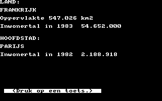](../dist/index.html?database=apps&example=basicode/countries) (c) J van Noort, 1989

Information about 178 countries in Dutch language.

### Doctor

[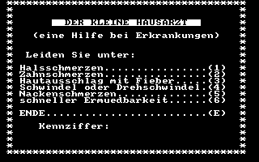](../dist/index.html?database=apps&example=basicode/doctor) (c) Andreas Garten, 1991

Ask the doctor ("Der kleine Hausarzt") in German language.

### Ellipses

[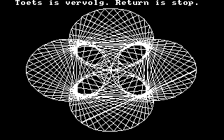](../dist/index.html?database=apps&example=basicode/ellipses)
[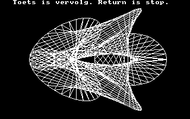](../dist/index.html?database=apps&example=basicode/ellipses) (c) Jaap Wieles

### Figures

[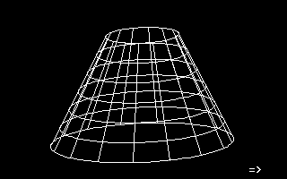](../dist/index.html?database=apps&example=basicode/figures)
[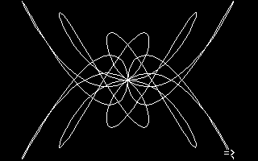](../dist/index.html?database=apps&example=basicode/figures) (c) Roland van Vugt, 1986

### Friendship

[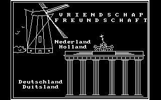](../dist/index.html?database=apps&example=basicode/friendsh) (c) Walther van den Elshout / Detlev Winkel, 1991

### Function Plotting

[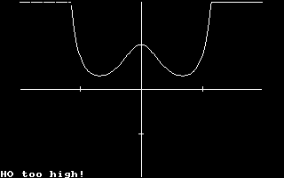](../dist/index.html?database=apps&example=basicode/funcplot) (c) Hannes Frank

### Impossible Figures

[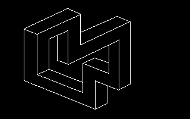](../dist/index.html?database=apps&example=basicode/imposfig)
[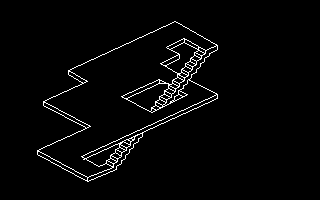](../dist/index.html?database=apps&example=basicode/imposfig) (c) Thomas Schäfer, 1991

### Nonius

[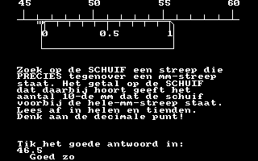](../dist/index.html?database=apps&example=basicode/nonius) (c) H.J. Pootjes, 1990

Do you know how to use a Vernier scale? With this program you can practice it. Explanations are in Dutch language.

### Reaction

[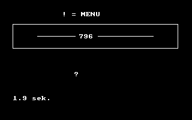](../dist/index.html?database=apps&example=basicode/reaction) (c) Ch.W. Brederode, 1989

Translated by Ronald Knak.

### Rotation

[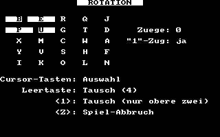](../dist/index.html?database=apps&example=basicode/rotation) (c) Thomas Rademacher, 2003

### RSA 1, 2, 3

[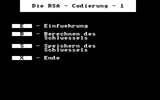](../dist/index.html?database=apps&example=basicode/rsa1) (c) Friedrich Dormeier, 1991

- [RSA 1](../dist/index.html?database=apps&example=basicode/rsa1)
- [RSA 2](../dist/index.html?database=apps&example=basicode/rsa2)
- [RSA 3](../dist/index.html?database=apps&example=basicode/rsa3)

### Tennis

[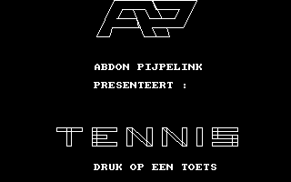](../dist/index.html?database=apps&example=basicode/tennis) (c) Abdon Pijpelink

### Typen

[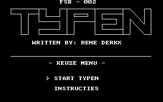](../dist/index.html?database=apps&example=basicode/typen)
[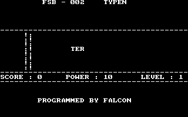](../dist/index.html?database=apps&example=basicode/typen) (c) Rene Derkx, 1990

## Links

- [A collection of BASICODE programs by various authors](https://github.com/robhagemans/basicode)

--

### **mv, 11/2020**
