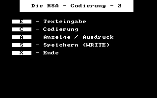
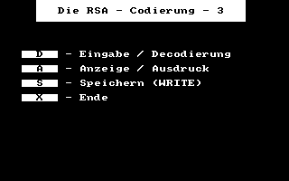

# CPCBasic Apps Collection (BasiCode)

[CPCBasicApps](https://benchmarko.github.io/CPCBasicApps/) is a collection of CPC BASIC apps.
They can be run on a Amstrad CPC 464/664/6128, in an emulator or with
[CPCBasic](https://benchmarko.github.io/CPCBasic/) or [CPCBasicTS](https://benchmarko.github.io/CPCBasicTS/).

Links:
[Source code](https://github.com/benchmarko/CPCBasicApps/),
[HTML Readme](https://github.com/benchmarko/CPCBasicApps/#readme),

## Some BasiCode programs

These programs use the [BasiCode](../../dist/index.html?database=apps&example=basicode/basicode) library which allows to write BASIC programs which run on systems with different BASIC dialects.
Check the [BasiCode](http://www.basicode.de/) page by Thomas Rademacher.
There is a is a tutorial with PDF documentation in  [BC3 Kurs](http://www.basicode.de/download/BC3_KURS.zip).

There is also an excellent [BASICODE Interpreter](https://robhagemans.github.io/basicode/) by Rob Hagemans. It runs in the browser and has a lot of sample programs.

### basicode - BasiCode {#basicode}

The library, which is merged to all other programs.

### bchelp - BC Help (BC Hilfe) {#bchelp}

 (c) Hannes Frank

### countries - Countries {#countries}

 (c) J van Noort, 1989

Information about 178 countries in Dutch language.

### doctor - Doctor {#doctor}

 (c) Andreas Garten, 1991

Ask the doctor ("Der kleine Hausarzt") in German language.

### ellipses - Ellipses {#ellipses}

 (c) Jaap Wieles

### figures - Figures {#figures}

 (c) Roland van Vugt, 1986

### friendsh - Friendship {#friendsh}

 (c) Walther van den Elshout / Detlev Winkel, 1991

### funcplot - Function Plotting {#funcplot}

 (c) Hannes Frank

### imposfig - Impossible Figures {#imposfig}

 (c) Thomas Schäfer, 1991

### nonius - Nonius {#nonius}

 (c) H.J. Pootjes, 1990

Do you know how to use a Vernier scale? With this program you can practice it. Explanations are in Dutch language.

### reaction - Reaction {#reaction}

 (c) Ch.W. Brederode, 1989

Translated by Ronald Knak.

### rotation - Rotation {#rotation}

 (c) Thomas Rademacher, 2003

### rsa1 - RSA 1 {#rsa1}

 (c) Friedrich Dormeier, 1991

### rsa2 - RSA 2 {#rsa2}

 (c) Friedrich Dormeier, 1991

### rsa3 - RSA 3 {#rsa3}

 (c) Friedrich Dormeier, 1991

### tennis - Tennis {#tennis}

 (c) Abdon Pijpelink

### typen - Typen {#typen}

 (c) Rene Derkx, 1990

## Links

- [A collection of BASICODE programs by various authors](https://github.com/robhagemans/basicode)

--

### **mv, 11/2020**
