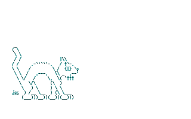

# CPCBasic Apps Collection (Demo)

CPCBasicApps is a collection of CPC BASIC apps.
They can be run on a Amstrad CPC 464/664/6128, in an emulator or with
[CPCBasic](https://benchmarko.github.io/CPCBasic/) or [CPCBasicTS](https://benchmarko.github.io/CPCBasicTS/).

Links:
[Source code](https://github.com/benchmarko/CPCBasicApps/),
[HTML Readme](https://github.com/benchmarko/CPCBasicApps/#readme),

## Some Demo Highlights

### 10 PRINT

[](https://benchmarko.github.io/CPCBasic/index.html?database=apps&example=demo/10print)

Check [10print.org](https://10print.org/) and read the book!

CPC version of the program:

```bash
10 PRINT CHR$(199+2*RND);:FRAME:GOTO 10
```

### 100% BASIC Demo

[](https://benchmarko.github.io/CPCBasic/index.html?database=apps&example=demo/100demo)
[](https://benchmarko.github.io/CPCBasic/index.html?database=apps&example=demo/100demo&input=%0d) (c) Markus Hohmann

Excellent BASIC demo.

On a real CPC, the pre-calculation phase takes longer than 3 minutes. With CPCBasic you will ask, which pre-calculating phase?

### Amstrad CPC 6128 Demo

[](https://benchmarko.github.io/CPCBasic/index.html?database=apps&example=demo/acpc6128)
[](https://benchmarko.github.io/CPCBasic/index.html?database=apps&example=demo/acpc6128) (c) Amstrad, 1985

### Art: Screens Unlimited

[](https://benchmarko.github.io/CPCBasic/index.html?database=apps&example=demo/art&input=11)
[](https://benchmarko.github.io/CPCBasic/index.html?database=apps&example=demo/art&input=2) (c)

Nice landscapes.

### ASCII Art

[](https://benchmarko.github.io/CPCBasic/index.html?database=apps&example=demo/asciiart) (c)

### BASIC World

[](https://benchmarko.github.io/CPCBasic/index.html?database=apps&example=demo/basworld) (c) Roald (Mr.Lou) Strauss

Title screen of an unfinished game with a nice tune.

### Boogle

[](https://benchmarko.github.io/CPCBasic/index.html?database=apps&example=demo/boogle) (c)

### British Council Tile Simulation

[](https://benchmarko.github.io/CPCBasic/index.html?database=apps&example=demo/btilesim)
[](https://benchmarko.github.io/CPCBasic/index.html?database=apps&example=demo/btilesim) (c) Rob Manuel, 2018

Check [Rob Manuel’s British Council Tile / Bus Fabric Sim](https://scruss.com/blog/2018/06/10/rob-manuels-british-council-tile-bus-fabric-sim/) on Stewart C. Russell's blog.

### Circle Writer

[](https://benchmarko.github.io/CPCBasic/index.html?database=apps&example=demo/circlewr) (c) COMTEC, 19xx

### Flags

[](https://benchmarko.github.io/CPCBasic/index.html?database=apps&example=demo/flags&input=1%0d)
[](https://benchmarko.github.io/CPCBasic/index.html?database=apps&example=demo/flags&input=2%0d) (c) Richard Fairhurst

### Graphics Demo 1

[](https://benchmarko.github.io/CPCBasic/index.html?database=apps&example=demo/gdemo&input=A)
[](https://benchmarko.github.io/CPCBasic/index.html?database=apps&example=demo/gdemo&input=E) (c)

Several nice graphics and animations, some with morphing effects. The original version uses assembler for sprite movements. CPCBasic is fast enough to do it all in BASIC.
Here we have "Windows" and "Pac-Man".

### Graphics Demo 2

[](https://benchmarko.github.io/CPCBasic/index.html?database=apps&example=demo/gdemo2&input=C)
[](https://benchmarko.github.io/CPCBasic/index.html?database=apps&example=demo/gdemo2&input=F) (c)

Some more nice graphics and animations, mainly done by changing colors.
Here we have "Blinker" and "R2D2".

### Grafix Demo

[](https://benchmarko.github.io/CPCBasic/index.html?database=apps&example=demo/grafix)
[](https://benchmarko.github.io/CPCBasic/index.html?database=apps&example=demo/grafix) (c) Dino, 1990

### House for Sale

[](https://benchmarko.github.io/CPCBasic/index.html?database=apps&example=demo/house) (c) Simon Baker, Kevin Parker, 1991

Just 9 lines of code, adapted for CPC 464 (no *FILL* command) by Out Bush.
Check the blog [FILLing them Ol'​ BASIC 10-Liners on a 464](https://www.linkedin.com/pulse/filling-them-ol-basic-10-liners-464-out-bush/).

### ISG Demo

[](https://benchmarko.github.io/CPCBasic/index.html?database=apps&example=demo/isgdemo) (c) Günter Woigk, 1986

Interrupt & Sound & Grafik (ISG) Demo

### Mondrian

[](https://benchmarko.github.io/CPCBasic/index.html?database=apps&example=demo/mondrian) (c) Out Bush, 2019

An improved version that creates more Mondrian-like paintings. For details, check the [CPCwiki](https://www.cpcwiki.eu/forum/programming/mondrian-next-try-to-get-a-topic/). The first version by SRS is based on [The Joy of Programming: Mondrian Painting](https://www.youtube.com/watch?v=FUp3SffxPzw).

### No Smoking (Screen)

[](https://benchmarko.github.io/CPCBasic/index.html?database=apps&example=demo/nosmoke) (c)

### Popsi (Screen)

[](https://benchmarko.github.io/CPCBasic/index.html?database=apps&example=demo/popsi) (c)

### Ray Eclipse

[](https://benchmarko.github.io/CPCBasic/index.html?database=apps&example=demo/rayclip) (c) Alan Scully

### Schneider CPC 6128 Demo

[](https://benchmarko.github.io/CPCBasic/index.html?database=apps&example=demo/scpc6128)
[](https://benchmarko.github.io/CPCBasic/index.html?database=apps&example=demo/scpc6128)
(c) Schneider/Amstrad, 1985

The complete demo. Additional data file for Schneider logo: scpc6128.dat.

The [Can-Can sound](https://benchmarko.github.io/CPCBasic/index.html?database=apps&example=music/cancan) can also be played separately.

### Serpent

[](https://benchmarko.github.io/CPCBasic/index.html?database=apps&example=demo/serpent) (c) T Magee, 1987

--

### **mv, 11/2020**
