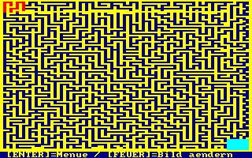

# CPCBasic Apps Collection (Games)

CPCBasicApps is a collection of CPC BASIC apps.
They can be run on a Amstrad CPC 464/664/6128, in an emulator or with
[CPCBasic](https://benchmarko.github.io/CPCBasic/) or [CPCBasicTS](https://benchmarko.github.io/CPCBasicTS/).

Links:
[Source code](https://github.com/benchmarko/CPCBasicApps/),
[HTML Readme](https://github.com/benchmarko/CPCBasicApps/#readme),

## Some Games Highlights

### 3D-Four In A Row (TODO)

(c) Dudley Brooke, 1987

### Atombunker

 (c) Marco Vieth, 1986

Atombunker Editor

 (c) Marco Vieth, 1986

Additional files:

- atombu0.dat - Map file
- atombu1.dat
- atombu2.dat

### Ball Cracker

 (c)

### Balloon

 (c)

### BASIC Game 2

 (c) Roald (Mr.Lou) Strauss

Unfinished BASIC game 2.

### Canyons of Cannons

 (c) Ingo Pax, 1985

### Car Drive (Autofahren)

 (c)

### Card Games

 (c)

Some card games: Blackjack ("17 und 4") and Memory.

### Catch

 (c) PC Amstrad International, 1990

### Citylander

 (c) Jujstronic Software, 1985

The tune [Fuer Elise](../../dist/index.html?database=apps&example=music/elise) by Ludwig van Beethoven can also be played separately.

### Clear Path

 (c) Peter Goode, 1984

A lander clone from [The Amstrad Program Book](https://archive.org/details/Amstrad_Program_Book_The_1984_Phoenix_Publishing_Associates/mode/2up) by Peter Goode, improved by [Im Wald](http://cpc-live.com/forum/index.php/topic,958.msg8133.html#msg8133).

### Connect 4 (Tower: 4 Gewinnt)

 (c) O. Zabel

### Copter Patrol

 (c) Christian Moeller, 1985

### CPCanabalt

 (c) Logiker, 2019

From the [BASIC 10-Liner Contest 2019](https://gkanold.wixsite.com/homeputerium/kopie-von-games-list-2019-2).

### Crib (Cribbage v1)

 (c)

### Cribbage (v2)

 (c) Nick Herrick, 1986

### Dambusters

 (c) Paul Stanley, 1984

### Duel

 (c) Bernhard Morell

### Dungeons (8 Bit Dungeons)

 (c) JNL, 2019

### Emperor (Kaiser)

 (c)

To select an action during the game, use joystick or numpad numbers.

### engelber - Engelbert

 (c) John Kennedy, 1984

### Garfunkel

 (c) Roland Bendig, 1987

### Goldrush (Goldrausch)

 (c) Jörg Walkowiak, 1984

### hopper - Hopper (Hüpfer)

 (c) Marco Vieth, 1986

 (c) Marco Vieth, 1986

### Inka Sogra

 (c) F. Meurer

### Jack-Pot

 (c) Jean-François SEHAN, 1985

### joker - Black Joker (Der Schwarze Joker)

 (c) Marco Vieth

### Klondike

 (c)

### Lander

 (c) Georg Huonker, 1985

### Maze

 (c) Joerg Heise

### Mini Chess

 (c) Matthias Uphoff, 1986

Additional file with learned positions: mchess.dat.
German Documentation can be found at [Software Experiment 6](http://cpctech.cpc-live.com/docs/dse/softex06.html).

### painty: Painty

 (c) ?

### Patience: The Card Game

 (c) Clive Blackmore

### President (Praesident)

 (c)

### Rogue Descender

 (c) Graham Briggs

BASIC 10-liner.

### Shielding Color

 (c) Antonio "acorpascuenca" Corpas Cuenca, 2019

From the [BASIC 10-Liner Contest 2019](https://gkanold.wixsite.com/homeputerium/kopie-von-games-list-2019-2).

### shot - Shot Game (Textual)

### smily - Smily

 (c) Medi-Software, 1985

Pac Man Clone

### Solitair

 (c) Uwe Ganter, 1985

### Solitair 2

 (c) Philip Jimenez, 1984

### Space Race

 (c) Peter Pekarek, 1986

### Space Base

 (c) Robin Nixon, 1986

- You are the captain of Earth's first space base in the asteroid belt.
- Your station acts as a base for mining ships to re-fuel and their crews to rest.
- However, hostile alien craft from the Andromeda galaxy are also mining the belt and will stop at nothing to prevent any competition from Earth.
- Your task is to defend the base from attack.
- Use Z and X to control your lazer and press ENTER to fire.

### Space War

 (c) Daniel Flower

Minimalistic fun!

### Stardodger

 (c) Stewart C. Russell

Minimalistic fun! You really need the SPACE key only.

Check [2D Star Dodge flies again!](https://scruss.com/blog/2012/09/08/2d-star-dodge-flies-again/) on Stewart C. Russell's blog.

### states - States of the Earth

 (c) Marco Vieth, 1988

Additional files:

- statesfx - States of the Earth (Data)

### Sultan's Maze

(c) Gem Software, 1984

On a real CPC, the game is rather slow, so I never played it. With CPCBasic it has a good speed now.

### Sunburst Contamination

 (c)

### Swamp

 (c) David Muir

- Your job is to destroy the eggs of giant frogs in the swamp. You move using cursor keys or joystick. You destroy the spawn by standing on it.
- You have to avoid the two frogs. If they catch you then you will lose one of your five lives.
- You score 10 for each egg destroyed. You gain a bonus of 100 and 1 extra life for each board of 72 eggs you destroy, after which you are given a new screen.

### Tanks Alot

 (c) Ross "Out Bush" Simpson, 2019

From the [BASIC 10-Liner Contest 2019](https://gkanold.wixsite.com/homeputerium/kopie-von-games-list-2019-2).

### Tarot Reader

 (c)

### Titan

(c) MS-Software, 1985

### Tower of Hanoi (Türme von Hanoi; Pagoden von Peking)

 (c)

### Yahtzee (Kniffel)

 (c) J. E. Muschik, 1985

### Yahtzee 2 (Kniffel)

 (c) Veb Mikroelektronik Muehlhausen

This version is based on Yahtzee 1 and uses MODE 1 and BASIC 1.1

--

### **mv, 11/2020**
