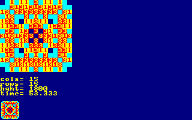
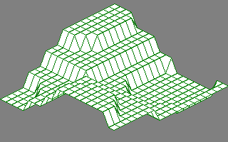
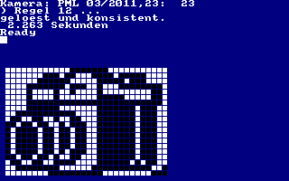
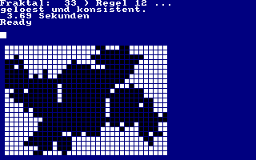
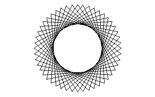
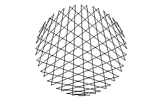

# CPCBasic Apps Collection (Math)

[CPCBasicApps](https://benchmarko.github.io/CPCBasicApps/) is a collection of CPC BASIC apps.
They can be run on a Amstrad CPC 464/664/6128, in an emulator or with
[CPCBasic](https://benchmarko.github.io/CPCBasic/) or [CPCBasicTS](https://benchmarko.github.io/CPCBasicTS/).

Links:
[Source code](https://github.com/benchmarko/CPCBasicApps/),
[HTML Readme](https://github.com/benchmarko/CPCBasicApps/#readme),

## Some Math Highlights {#math-highlights}

### abelian - Abelian sandpile model {#abelian}

Original version: [Abelian sandpile model](../rosetta/#abelian) in the Rosetta Code collection.

### anageo - Analytical Geometry {#anageo}

### complex - Complex numbers (Komplexe Zahlen) {#complex}

### derivat - Derivatives of Polynomials (Ableitungen eines Polynoms) {#derivat}

### division - Division of long numbers (Division langer Zahlen) {#division}

### euler - Compute e with 1000 digits {#euler}

### factorials - Big Factorials (Berechnung grosser Fakultaeten) {#factorials}

### fractals - Fractals {#fractals}

 (c) A. Mueller & CPC Internat., 1992

### fractions - Fractions (Bruchrechnen) {#fractions}

### funcarea - Functional Area {#funcarea}

### funcspec - Functional Spectrum {#funcspec}

### graph6 - 3D Hidden Line Removal Graph {#graph6}

 (c) John Valentine, 1988

### logicals - Logicals {#logicals}

 (c) marcm200

### ninedig2 - Nine Digits 2 (tokenized BASIC) {#ninedig2}

### quadfunc - Quadratic Function {#quadfunc}

### raytrace - Raytracing {#raytrace}

### regress - Regression (Ausgleich) {#regress}

### striart - String Art {#striart}

--

### **mv, 09/2022**
