# CPCBasic Apps Collection (Math)

CPCBasicApps is a collection of CPC BASIC apps.
They can be run on a Amstrad CPC 464/664/6128, in an emulator or with
[CPCBasic](https://benchmarko.github.io/CPCBasic/) or [CPCBasicTS](https://benchmarko.github.io/CPCBasicTS/).

Links:
[Source code](https://github.com/benchmarko/CPCBasicApps/),
[HTML Readme](https://github.com/benchmarko/CPCBasicApps/#readme),

## Some Math Highlights

### anageo - Analytical Geometry

[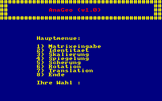](../dist/index.html?database=apps&example=math/anageo)
[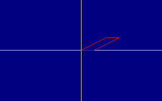](../dist/index.html?database=apps&example=math/anageo)

### complex - Complex numbers (Komplexe Zahlen)

[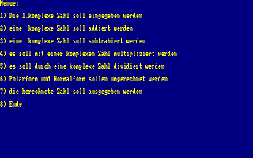](../dist/index.html?database=apps&example=math/complex)

### derivat - Derivatives of Polynomials (Ableitungen eines Polynoms)

[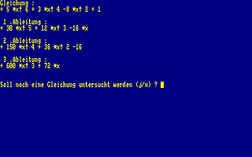](../dist/index.html?database=apps&example=math/derivat)

### division - Division of long numbers (Division langer Zahlen)

[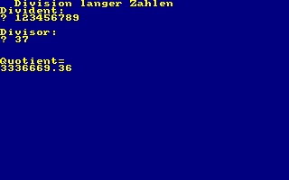](../dist/index.html?database=apps&example=math/division)

### euler - Compute e with 1000 digits

[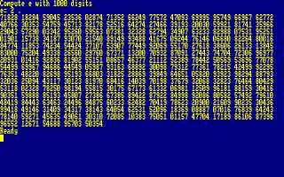](../dist/index.html?database=apps&example=math/euler)

### factorials - Big Factorials (Berechnung grosser Fakultaeten)

[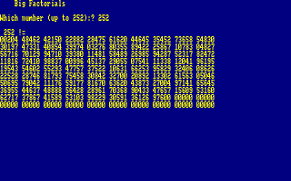](../dist/index.html?database=apps&example=math/factorials)

### Fractals

[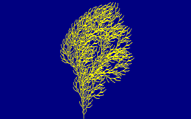](../dist/index.html?database=apps&example=math/fractals) (c) A. Mueller & CPC Internat., 1992

### fractions - Fractions (Bruchrechnen)

[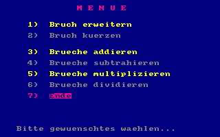](../dist/index.html?database=apps&example=math/fractions)
[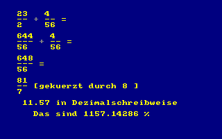](../dist/index.html?database=apps&example=math/fractions)

### funcarea - Functional Area

### funcspec - Functional Spectrum

[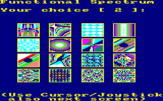](../dist/index.html?database=apps&example=math/funcspec)
[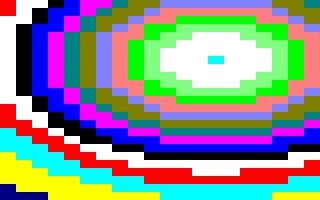](../dist/index.html?database=apps&example=math/funcspec)

### ninedig2 - Nine Digits 2 (tokenized BASIC)

[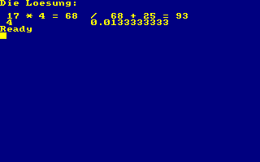](../dist/index.html?database=apps&example=math/ninedig2)

### Quadratic Function

[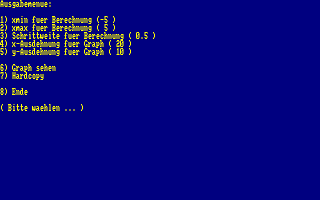](../dist/index.html?database=apps&example=quadfunc)
[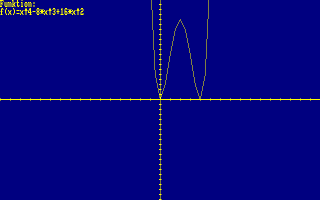](../dist/index.html?database=apps&example=quadfunc) TODO

### raytrace - Raytracing

[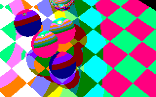](../dist/index.html?database=apps&example=math/raytrace)

### regress - Regression (Ausgleich)

[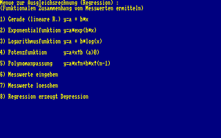](../dist/index.html?database=apps&example=math/regress)
[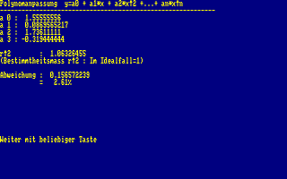](../dist/index.html?database=apps&example=math/regress)

--

### **mv, 09/2022**
