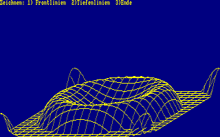

# CPCBasic Apps Collection (Math)

CPCBasicApps is a collection of CPC BASIC apps.
They can be run on a Amstrad CPC 464/664/6128, in an emulator or with
[CPCBasic](https://benchmarko.github.io/CPCBasic/) or [CPCBasicTS](https://benchmarko.github.io/CPCBasicTS/).

Links:
[Source code](https://github.com/benchmarko/CPCBasicApps/),
[HTML Readme](https://github.com/benchmarko/CPCBasicApps/#readme),

## Some Math Highlights

TODO...

### anageo - Analytical Geometry

### complex - Complex numbers (Komplexe Zahlen)

### derivat - Derivatives of Polynomials (Ableitungen eines Polynoms)

### division - Division of long numbers (Division langer Zahlen)

### euler - Compute e with 1000 digits

### factorials - Big Factorials (Berechnung grosser Fakultaeten)

### Fractals

 (c) A. Mueller & CPC Internat., 1992

### fractions - Fractions (Bruchrechnen)

### funcarea - Functional Area

### funcspec - Functional Spectrum

### ninedig2 - Nine Digits 2 (tokenized BASIC)

### Quadratic Function

 TODO

### regress - Regression (Ausgleich)

--

### **mv, 09/2022**
