# CPCBasic Apps Collection (Music)

CPCBasicApps is a collection of CPC BASIC apps.
They can be run on a Amstrad CPC 464/664/6128, in an emulator or with
[CPCBasic](https://benchmarko.github.io/CPCBasic/) or [CPCBasicTS](https://benchmarko.github.io/CPCBasicTS/).

Links:
[Source code](https://github.com/benchmarko/CPCBasicApps/),
[HTML Readme](https://github.com/benchmarko/CPCBasicApps/#readme),

## Some Music Highlights

### A small BASIC tune

[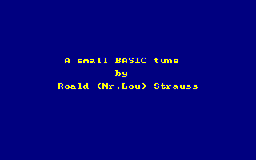](../../dist/index.html?database=apps&example=music/asbtune) (c) Roald (Mr.Lou) Strauss, 2018

A fantastic tune! One of my favorites.

### Axel F

[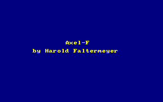](../../dist/index.html?database=apps&example=music/axelf) by Harold Faltermeyer

### Bach

[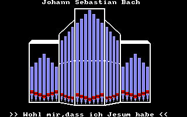](../../dist/index.html?database=apps&example=music/bach) (c) Wolfgang Volz

Johann Sebastian Bach: "Wohl mir,dass ich Jesum habe"

### Cancan

[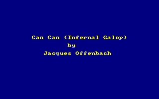](../../dist/index.html?database=apps&example=music/cancan)

Can Can (Infernal Galop) by Jacques Offenbach.
The Schneider CPC 6128 Demo Music.

### Clarinet

[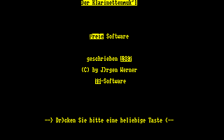](../../dist/index.html?database=apps&example=music/clarinet) (c) Juergen Werner

Clarinet (Klarinettenmuck'l, Jaroslav Skabrada)

### CPC Organ

[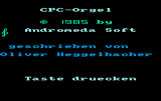](../../dist/index.html?database=apps&example=music/cpcorgan)
[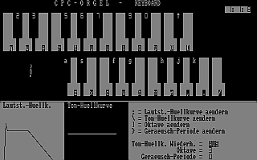](../../dist/index.html?database=apps&example=music/cpcorgan) (c) Oliver Heggelbacher

CPC Organ (CPC-Orgel) (an app)

### Deutschland Hymne

[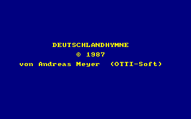](../../dist/index.html?database=apps&example=music/dthymne) (c) Andreas Meyer, 1987

### Elise

[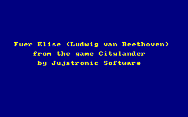](../../dist/index.html?database=apps&example=music/elise) (c) Jujstronic Software, 1985

"Fuer Elise" by Ludwig van Beethoven. Taken from the game Citylander by Jujstronic Software. I have optimized the code a bit.

### Menuett

[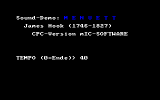](../../dist/index.html?database=apps&example=music/menuett) (c) mIC-Software

Menuett (Minuet) by James Hook

### Mexicana

[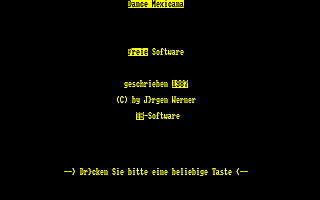](../../dist/index.html?database=apps&example=music/mexicana) (c) Juergen Werner

Dance Mexicana (Jarabe Tapatio, Mexican Hat Dance)

### Rocking CPC

[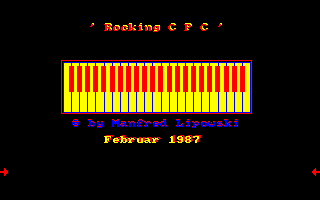](../../dist/index.html?database=apps&example=music/rocking) (c) Manfred Lipowski, 1987

### Roxette

[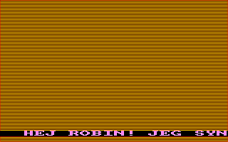](../../dist/index.html?database=apps&example=music/roxette) (c) Roald (Mr.Lou) Strauss

Roxette: Listen To Your Heart

### Tico Tico

[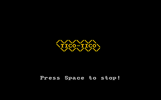](../../dist/index.html?database=apps&example=music/ticotico)

### Touch

[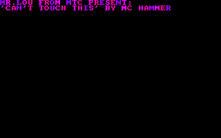](../../dist/index.html?database=apps&example=music/touch) (c) Roald (Mr.Lou) Strauss

U Can't Touch This (MC Hammer)

--

### **mv, 11/2020**
