# CPCBasic Rosetta Code Collection

CPCBasicApps is a collection of CPC BASIC apps.
They can be run on a Amstrad CPC 464/664/6128, in an emulator or with
[CPCBasic](https://benchmarko.github.io/CPCBasic/) or [CPCBasicTS](https://benchmarko.github.io/CPCBasicTS/).

Links:
[Source code](https://github.com/benchmarko/CPCBasicApps/),
[HTML Readme](https://github.com/benchmarko/CPCBasicApps/#readme),

## Some Rosetta Code Highlights

[Rosetta Code](https://rosettacode.org/) is a programming chrestomathy site.

### 24game - The 24 Game

[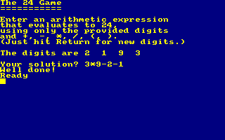](../../dist/index.html?database=apps&example=rosetta/24game)

### abelian - Abelian sandpile model {#abelian}

[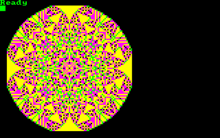](../../dist/index.html?database=apps&example=rosetta/abelian)

### animate - Animate a pendulum

[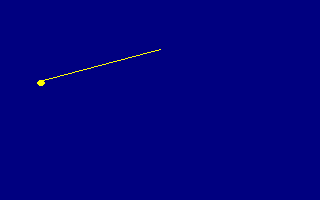](../../dist/index.html?database=apps&example=rosetta/animate)

### archimed - Archimedean spiral

[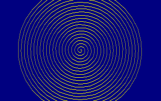](../../dist/index.html?database=apps&example=rosetta/archimed)

### audiofre - Audio frequency generator

[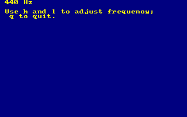](../../dist/index.html?database=apps&example=rosetta/audiofre)

### barnsley - Barnsley fern

[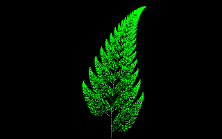](../../dist/index.html?database=apps&example=rosetta/barnsley)

### binary - Binary digits

[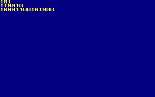](../../dist/index.html?database=apps&example=rosetta/binary)

### biorhyth - Biorhythms

[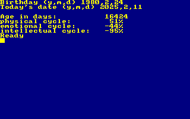](../../dist/index.html?database=apps&example=rosetta/biorhyth)

### brownian - Brownian tree

[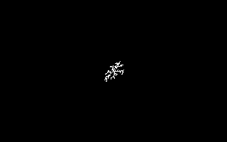](../../dist/index.html?database=apps&example=rosetta/brownian)

### callfor - Call a foreign-language function

### chaos - Chaos game

[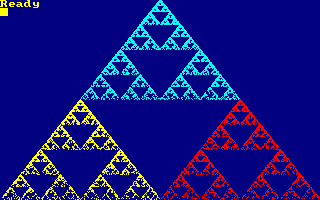](../../dist/index.html?database=apps&example=rosetta/chaos)

### colorscr - Color of a screen pixel

[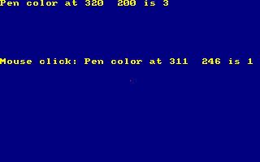](../../dist/index.html?database=apps&example=rosetta/colorscr)

### colorbar - Colour bars/Display

[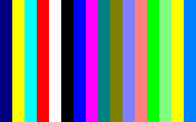](../../dist/index.html?database=apps&example=rosetta/colorbar)

### constrpo - Constrained random points on a circle

[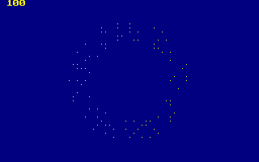](../../dist/index.html?database=apps&example=rosetta/constrpo)

### deletefi - Delete a file

### detectdi - Detect division by zero

[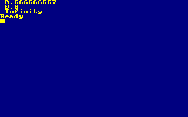](../../dist/index.html?database=apps&example=rosetta/detectdi)

### drawclk - Draw a clock

[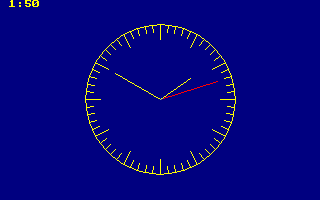](../../dist/index.html?database=apps&example=rosetta/drawclk)

### drawcub - Draw a cuboid

### drawsp - Draw a sphere (ASCII)

[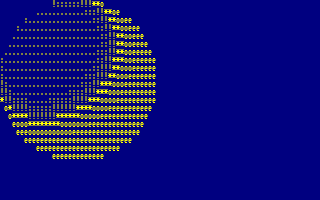](../../dist/index.html?database=apps&example=rosetta/drawsp)

### drawsp2 - Draw a sphere

[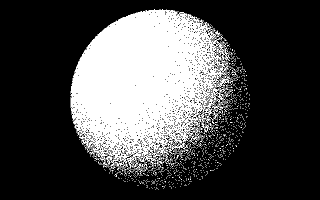](../../dist/index.html?database=apps&example=rosetta/drawsp2)

### ethiopia - Ethiopian multiplication

[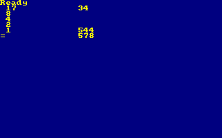](../../dist/index.html?database=apps&example=rosetta/ethiopia)

### execute - Execute a system command

[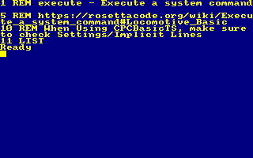](../../dist/index.html?database=apps&example=rosetta/execute)

### forest - Forest fire

[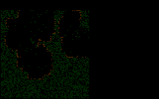](../../dist/index.html?database=apps&example=rosetta/forest)

### function - Function definition

[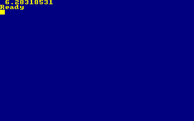](../../dist/index.html?database=apps&example=rosetta/function)

### gofish - Go Fish

[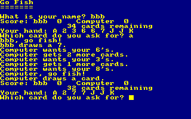](../../dist/index.html?database=apps&example=rosetta/gofish)

### guessnum - Guess the number

[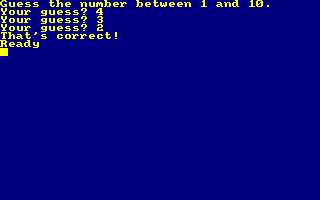](../../dist/index.html?database=apps&example=rosetta/guessnum)

### guessnfb - Guess the number with feedback

[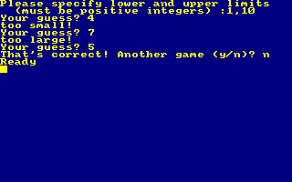](../../dist/index.html?database=apps&example=rosetta/guessnfb)

### happynum - Happy numbers

[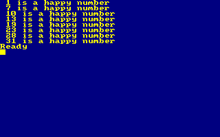](../../dist/index.html?database=apps&example=rosetta/happynum)

### hellolp - Hello world (Line printer)

### hellonb - Hello world (Newbie)

[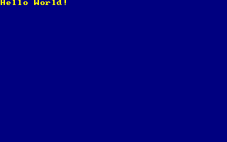](../../dist/index.html?database=apps&example=rosetta/hellonb)

### introspe - Introspection

[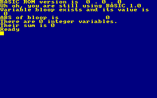](../../dist/index.html?database=apps&example=rosetta/introspe)

### joystick - Joystick position

[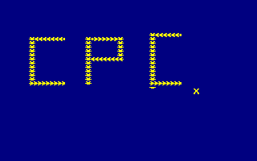](../../dist/index.html?database=apps&example=rosetta/joystick)

### juliaset - Julia set

[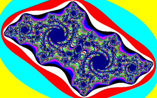](../../dist/index.html?database=apps&example=rosetta/juliaset)

### keybofl - Keyboard input: Flush the keyboard buffer

### keyboyn - Keyboard input: Obtain a Y or N response

[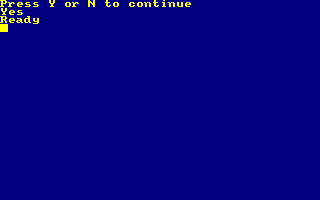](../../dist/index.html?database=apps&example=rosetta/keyboyn)

### knights - Knight's tour

[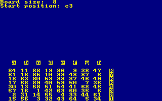](../../dist/index.html?database=apps&example=rosetta/knights)

### langtons - Langton's ant

[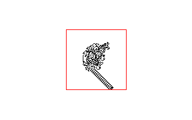](../../dist/index.html?database=apps&example=rosetta/langtons)

### magic8 - Magic 8-ball

[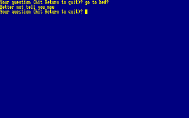](../../dist/index.html?database=apps&example=rosetta/magic8)

### makeback - Make a backup file

[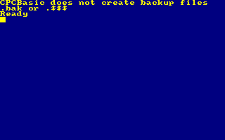](../../dist/index.html?database=apps&example=rosetta/makeback)

### mandelbr - Mandelbrot set

[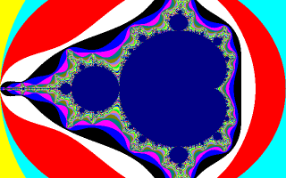](../../dist/index.html?database=apps&example=rosetta/mandelbr)

### matrixra - Matrix digital rain

[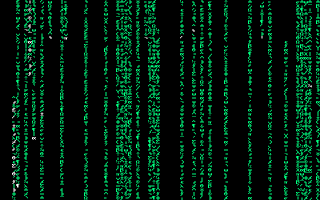](../../dist/index.html?database=apps&example=rosetta/matrixra)

### mcnugget - McNuggets problem

[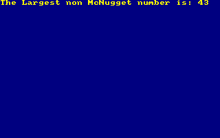](../../dist/index.html?database=apps&example=rosetta/mcnugget)

### metronom - Metronome

[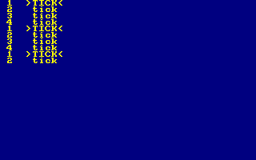](../../dist/index.html?database=apps&example=rosetta/metronom)

### mineswee - Minesweeper game

[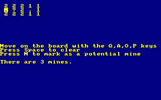](../../dist/index.html?database=apps&example=rosetta/mineswee)

(to be continued)

### **mv, 03/2025**
