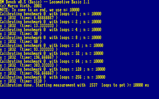
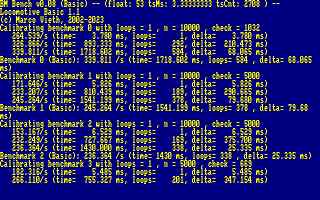
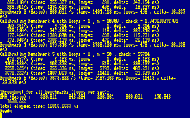
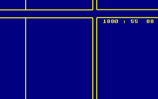
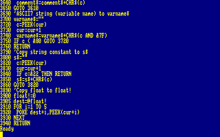
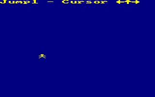
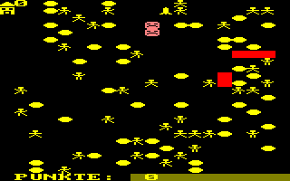
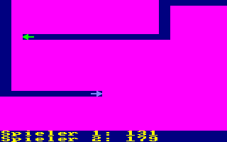

# CPCBasic Apps Collection (Test)

CPCBasicApps is a collection of CPC BASIC apps.
They can be run on a Amstrad CPC 464/664/6128, in an emulator or with
[CPCBasic](https://benchmarko.github.io/CPCBasic/) or [CPCBasicTS](https://benchmarko.github.io/CPCBasicTS/).

Links:
[Source code](https://github.com/benchmarko/CPCBasicApps/),
[HTML Readme](https://github.com/benchmarko/CPCBasicApps/#readme),

## Some Test Highlights

### art - Computer Art

[](../../dist/index.html?database=apps&example=test/art)

### Basic Bank Manager

[](../../dist/index.html?database=apps&example=test/basbankm) (c) Marco Vieth

### blocky - Blocky CPC Demo

[](../../dist/index.html?database=apps&example=test/blocky) (c)

### BM Benchmark 3

[](../../dist/index.html?database=apps&example=test/bmbench3) (c) Marco Vieth, 2002

### BM Benchmark 8

[](../../dist/index.html?database=apps&example=test/bmbench8)
[](../../dist/index.html?database=apps&example=test/bmbench8) (c) Marco Vieth, 2023

### Character set

[](../../dist/index.html?database=apps&example=test/charset) (c) Marco Vieth

### cpc464ch - CPC 464 Character Art

[](../../dist/index.html?database=apps&example=test/cpc464ch)

### cpcbasic - CPC Basic

[](../../dist/index.html?database=apps&example=test/cpcbasic)

### Circles

[](../../dist/index.html?database=apps&example=test/circles) (c) Marco Vieth

### colors - Colors CPC Demo

[](../../dist/index.html?database=apps&example=test/colors) (c)

### cpclib - CPC Library

The CPC Library is used by some tests and provides the following functions:

```basic
c.c=1: gosub 9010: 'initCpcLib
c.c=2: c.iv%=50: gosub 9010: 'wait (c.iv% 1/50 sec)
c.c=3: c.iv%=50: gosub 9010: 'waitOrKey (c.iv% 1/50 sec, or until keypress, return c.t$)
c.c=4: gosub 9010: 'checkMode (return max available mode c.m%=3 or c.m%=2)
```

### CPC MHz

[](../../dist/index.html?database=apps&example=test/cpcmhz) (c) Marco Vieth

### crtctest - CRTC Test (TODO)

[](../../dist/index.html?database=apps&example=test/crtctest) (c) Marco Vieth

### crypto1 - Cryptology 1

[](../../dist/index.html?database=apps&example=test/crypto1)

### detoken - Detokenize BASIC program

[](../../dist/index.html?database=apps&example=test/detoken) (c) Mike Sutton, 2022

### energy0 - Energy Collectors 0 (Game)

[](../../dist/index.html?database=apps&example=games/energy0) (c) Marco Vieth, 1985

### energy1 - Energy Collectors 1 (Game)

[](../../dist/index.html?database=apps&example=games/energy1) (c) Marco Vieth, 1985

### energysa - Energy Savers (Game)

[](../../dist/index.html?database=apps&example=games/energysa) (c) Marco Vieth, 1985

### Extended RAM Test

[](../../dist/index.html?database=apps&example=test/eramtst) (c) TFM / FutureSoft, 2014

### Fancy copychr$

[](../../dist/index.html?database=apps&example=test/fancy) (c) Marco Vieth

### Fill

[](../../dist/index.html?database=apps&example=test/fill) (c)

### graphics - Graphics CPC Demo

[](../../dist/index.html?database=apps&example=test/graphics) (c)

### jump1 - Jump Test 1

[](../../dist/index.html?database=apps&example=test/jump1) (c)

### Keyboard

[](../../dist/index.html?database=apps&example=test/keyboard) (c) Marco Vieth

### labyrinth - Labyrinth

[](../../dist/index.html?database=apps&example=test/labyrinth)

### landscape - Landscape

[](../../dist/index.html?database=apps&example=test/landscape)

### Line Mask

[](../../dist/index.html?database=apps&example=test/linemask) (c) Marco Vieth

### mouse - Mouse escaping from a maze

[](../../dist/index.html?database=apps&example=test/mouse)

### Mouse Painting

[](../../dist/index.html?database=apps&example=test/mousepa) (c) Marco Vieth

### movepack - Move Pack

[](../../dist/index.html?database=apps&example=test/movepack) (c) Marco Vieth

### piechart - Pie Chart

[](../../dist/index.html?database=apps&example=test/piechart)

### Pixel Test (Mode 0)

[](../../dist/index.html?database=apps&example=test/pixeltst) (c) Marco Vieth

### RAM Test

[](../../dist/index.html?database=apps&example=test/ramtest) (c) Marco Vieth

### rastercircle - Raster Circle

[](../../dist/index.html?database=apps&example=test/rastercircle)

### Rectangles Test

[](../../dist/index.html?database=apps&example=test/rectangles) (c) Marco Vieth

### Reference Timings

[](../../dist/index.html?database=apps&example=test/reftime) (c) Marco Vieth

### Screen Memory Test

[](../../dist/index.html?database=apps&example=test/scrtest) (c) Marco Vieth

### Seconds Test

[](../../dist/index.html?database=apps&example=test/seconds) (c) Marco Vieth

### scrudu - Scrudu (Gedichte)

[](../../dist/index.html?database=apps&example=test/scrudu)

- scrudu.vok - Scrudu Vokabular

### simple - Simple Labyrinth

[](../../dist/index.html?database=apps&example=test/simple)

### snake42 - Snake 4 Two

[](../../dist/index.html?database=apps&example=test/snake42)

### soundtest1 - Sound Test 1

[](../../dist/index.html?database=apps&example=test/soundtest1)

### sphere - Sphere

[](../../dist/index.html?database=apps&example=test/sphere)

### Stars Test 1 and 2

[](../../dist/index.html?database=apps&example=test/stars) (c)

--

### **mv, 11/2020**
