# CPCBasic Rosetta Code Collection

[CPCBasicApps](https://benchmarko.github.io/CPCBasicApps/) is a collection of CPC BASIC apps.
They can be run on a Amstrad CPC 464/664/6128, in an emulator or with
[CPCBasic](https://benchmarko.github.io/CPCBasic/) or [CPCBasicTS](https://benchmarko.github.io/CPCBasicTS/).

Links:
[Source code](https://github.com/benchmarko/CPCBasicApps/),
[HTML Readme](https://github.com/benchmarko/CPCBasicApps/#readme),

## Some Rosetta Code Highlights

[Rosetta Code](https://rosettacode.org/) is a programming chrestomathy site.
It has coding examples for many programming languages including [Locomotive_Basic](https://rosettacode.org/wiki/Category:Locomotive_Basic).
The examples from Rosetta Code are are available under the GNU Free Documentation License,
version 1.2: [GNU FDL 1.2](https://www.gnu.org/licenses/fdl-1.2.html),
see also [Rosetta_Code: Copyrights](https://rosettacode.org/wiki/Rosetta_Code:Copyrights).

### 24game - The 24 Game {#24game}

[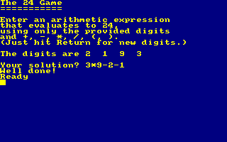](../../dist/index.html?database=apps&example=rosetta/24game)

Taken from [Rosetta Code: The 24 Game](https://rosettacode.org/wiki/24_game#Locomotive_Basic).

### abelian - Abelian sandpile model {#abelian}

[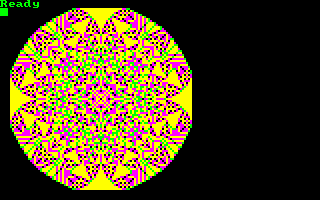](../../dist/index.html?database=apps&example=rosetta/abelian)

Taken from [Rosetta Code: Abelian sandpile model](https://rosettacode.org/wiki/Abelian_sandpile_model#Locomotive_Basic).

### animate - Animate a pendulum {#animate}

[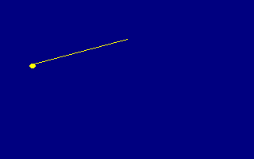](../../dist/index.html?database=apps&example=rosetta/animate)

Taken from [Rosetta Code: Animate a pendulum](https://rosettacode.org/wiki/Animate_a_pendulum#Locomotive_Basic).

### archimed - Archimedean spiral {#archimed}

[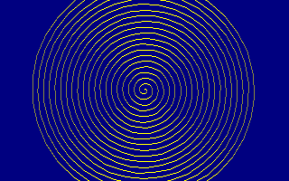](../../dist/index.html?database=apps&example=rosetta/archimed)

Taken from [Rosetta Code: Archimedean spiral](https://rosettacode.org/wiki/Archimedean_spiral#Locomotive_Basic).

### audiofre - Audio frequency generator {#audiofre}

[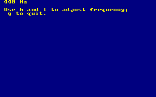](../../dist/index.html?database=apps&example=rosetta/audiofre)

Taken from [Rosetta Code: Audio frequency generator](https://rosettacode.org/wiki/Audio_frequency_generator#Locomotive_Basic).

### barnsley - Barnsley fern {#barnsley}

Taken from [Rosetta Code: Barnsley fern](https://rosettacode.org/wiki/Barnsley_fern#Locomotive_Basic).

### binary - Binary digits {#binary}

[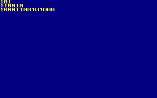](../../dist/index.html?database=apps&example=rosetta/binary)

Taken from [Rosetta Code: Binary digits](https://rosettacode.org/wiki/Binary_digits#Locomotive_Basic).

### biorhyth - Biorhythms {#biorhyth}

[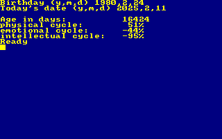](../../dist/index.html?database=apps&example=rosetta/biorhyth)

Taken from [Rosetta Code: Biorhythms](https://rosettacode.org/wiki/Biorhythms#Locomotive_Basic).

### brownian - Brownian tree {#brownian}

Taken from [Rosetta Code: Brownian tree](https://rosettacode.org/wiki/Brownian_tree#Locomotive_Basic).

### callfor - Call a foreign-language function {#callfor}

Taken from [Rosetta Code: Call a foreign-language function](https://rosettacode.org/wiki/Call_a_foreign-language_function#Locomotive_Basic).

### chaos - Chaos game {#chaos}

[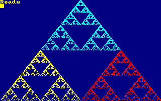](../../dist/index.html?database=apps&example=rosetta/chaos)

Taken from [Rosetta Code: Chaos game](https://rosettacode.org/wiki/Chaos_game#Locomotive_Basic).

### colorbar - Colour bars/Display {#colorbar}

[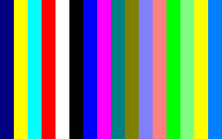](../../dist/index.html?database=apps&example=rosetta/colorbar)

Taken from [Rosetta Code: Colour bars/Display](https://rosettacode.org/wiki/Colour_bars/Display#Locomotive_Basic).

### colorscr - Color of a screen pixel {#colorscr}

Taken from [Rosetta Code: Color of a screen pixel](https://rosettacode.org/wiki/Color_of_a_screen_pixel#Locomotive_Basic).

### constrpo - Constrained random points on a circle {#constrpo}

[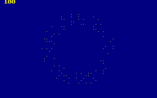](../../dist/index.html?database=apps&example=rosetta/constrpo)

Taken from [Rosetta Code: Constrained random points on a circle](https://rosettacode.org/wiki/Constrained_random_points_on_a_circle#Locomotive_Basic).

### deletefi - Delete a file {#deletefi}

Taken from [Rosetta Code: Delete a file](https://rosettacode.org/wiki/Delete_a_file#Locomotive_Basic).

### detectdi - Detect division by zero {#detectdi}

[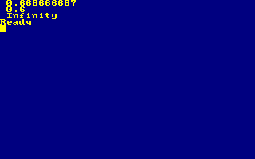](../../dist/index.html?database=apps&example=rosetta/detectdi)

Taken from [Rosetta Code: Detect division by zero](https://rosettacode.org/wiki/Detect_division_by_zero#Locomotive_Basic).

### drawclk - Draw a clock {#drawclk}

[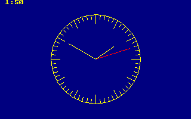](../../dist/index.html?database=apps&example=rosetta/drawclk)

Taken from [Rosetta Code: Draw a clock](https://rosettacode.org/wiki/Draw_a_clock#Locomotive_Basic).

### drawcub - Draw a cuboid {#drawcub}

[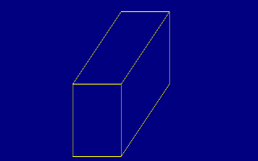](../../dist/index.html?database=apps&example=rosetta/drawcub)

Taken from [Rosetta Code:  Draw a cuboid](https://rosettacode.org/wiki/Draw_a_cuboid#Locomotive_Basic).

### drawsp - Draw a sphere (ASCII) {#drawsp}

[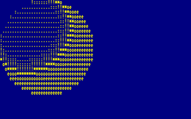](../../dist/index.html?database=apps&example=rosetta/drawsp)

Taken from [Rosetta Code: Draw a sphere](https://rosettacode.org/wiki/Draw_a_sphere#Locomotive_Basic).

### drawsp2 - Draw a sphere {#drawsp2}

[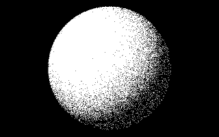](../../dist/index.html?database=apps&example=rosetta/drawsp2)

Taken from [Rosetta Code: Draw a sphere](https://rosettacode.org/wiki/Draw_a_sphere#Locomotive_Basic).

### ethiopia - Ethiopian multiplication {#ethiopia}

[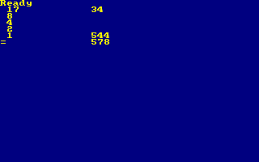](../../dist/index.html?database=apps&example=rosetta/ethiopia)

Taken from [Rosetta Code: Ethiopian multiplication](https://rosettacode.org/wiki/Ethiopian_multiplication#Locomotive_Basic).

### execute - Execute a system command {#execute}

[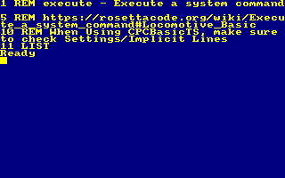](../../dist/index.html?database=apps&example=rosetta/execute)

Taken from [Rosetta Code: Execute a system command](https://rosettacode.org/wiki/Execute_a_system_command#Locomotive_Basic).

### forest - Forest fire {#forest}

[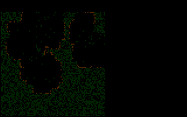](../../dist/index.html?database=apps&example=rosetta/forest)

Taken from [Rosetta Code: Forest fire](https://rosettacode.org/wiki/Forest_fire#Locomotive_Basic).

### function - Function definition {#function}

Taken from [Rosetta Code: Function definition](https://rosettacode.org/wiki/Function_definition#Locomotive_Basic).

### gofish - Go Fish {#gofish}

[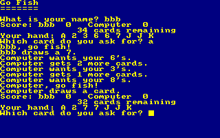](../../dist/index.html?database=apps&example=rosetta/gofish)

Taken from [Rosetta Code: Go Fish](https://rosettacode.org/wiki/Go_Fish#Locomotive_Basic).

### guessnfb - Guess the number with feedback {#guessnfb}

[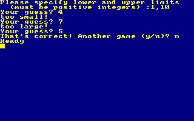](../../dist/index.html?database=apps&example=rosetta/guessnfb)

Taken from [Rosetta Code: Guess the number with feedback](https://rosettacode.org/wiki/Guess_the_number/With_feedback#Locomotive_Basic).

### guessnum - Guess the number {#guessnum}

[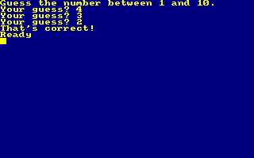](../../dist/index.html?database=apps&example=rosetta/guessnum)

Taken from [Rosetta Code: Guess the number](https://rosettacode.org/wiki/Guess_the_number#Locomotive_Basic).

### happynum - Happy numbers {#happynum}

[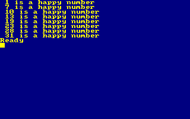](../../dist/index.html?database=apps&example=rosetta/happynum)

Taken from [Rosetta Code: Happy numbers](https://rosettacode.org/wiki/Happy_numbers#Locomotive_Basic).

### hellolp - Hello world (Line printer) {#hellolp}

Taken from [Rosetta Code: Hello world (Line printer)](https://rosettacode.org/wiki/Hello_world/Line_printer#Locomotive_Basic).

### hellonb - Hello world (Newbie) {#hellonb}

Taken from [Rosetta Code: Hello world (Newbie)](https://rosettacode.org/wiki/Hello_world/Newbie#Locomotive_Basic).

### introspe - Introspection {#introspe}

[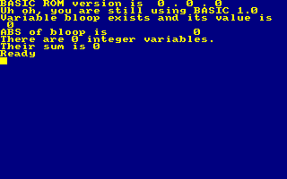](../../dist/index.html?database=apps&example=rosetta/introspe)

Taken from [Rosetta Code: Introspection](https://rosettacode.org/wiki/Introspection#Locomotive_Basic).

### joystick - Joystick position {#joystick}

[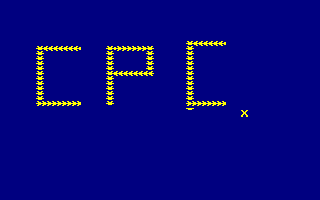](../../dist/index.html?database=apps&example=rosetta/joystick)

Taken from [Rosetta Code: Joystick position](https://rosettacode.org/wiki/Joystick_position#Locomotive_Basic).

### juliaset - Julia set {#juliaset}

Taken from [Rosetta Code: Julia set](https://rosettacode.org/wiki/Julia_set#Locomotive_Basic).

### keybofl - Keyboard input: Flush the keyboard buffer {#keybofl}

Taken from [Rosetta Code: Keyboard input: Flush the keyboard buffer](https://rosettacode.org/wiki/Keyboard_input/Flush_the_keyboard_buffer#Locomotive_Basic).

### keyboyn - Keyboard input: Obtain a Y or N response {#keyboyn}

[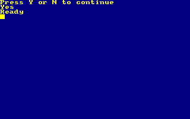](../../dist/index.html?database=apps&example=rosetta/keyboyn)

Taken from [Rosetta Code: Keyboard input: Obtain a Y or N response](https://rosettacode.org/wiki/Keyboard_input/Obtain_a_Y_or_N_response#Locomotive_Basic).

### knights - Knight's tour {#knights}

[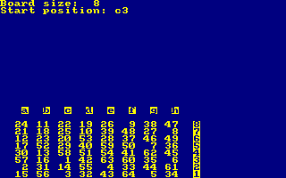](../../dist/index.html?database=apps&example=rosetta/knights)

Taken from [Rosetta Code: Knight's tour](https://rosettacode.org/wiki/Knight%27s_tour#Locomotive_Basic).

### langtons - Langton's ant {#langtons}

[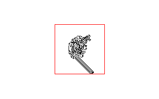](../../dist/index.html?database=apps&example=rosetta/langtons)

Taken from [Rosetta Code: Langton's ant](https://rosettacode.org/wiki/Langton%27s_ant#Locomotive_Basic).

### magic8 - Magic 8-ball {#magic8}

[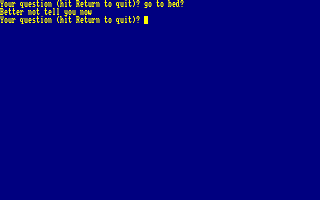](../../dist/index.html?database=apps&example=rosetta/magic8)

Taken from [Rosetta Code: Magic 8-ball](https://rosettacode.org/wiki/Magic_8-ball#Locomotive_Basic).

### makeback - Make a backup file {#makeback}

[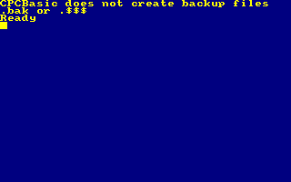](../../dist/index.html?database=apps&example=rosetta/makeback)

Taken from [Rosetta Code: Make a backup file](https://rosettacode.org/wiki/Make_a_backup_file#Locomotive_Basic).

### mandelbr - Mandelbrot set {#mandelbr}

Taken from [Rosetta Code: Mandelbrot set](https://rosettacode.org/wiki/Mandelbrot_set#Locomotive_Basic).

### matrixra - Matrix digital rain {#matrixra}

[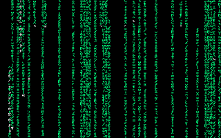](../../dist/index.html?database=apps&example=rosetta/matrixra)

Taken from [Rosetta Code: Matrix digital rain](https://rosettacode.org/wiki/Matrix_digital_rain#Locomotive_Basic).

### mcnugget - McNuggets problem {#mcnugget}

[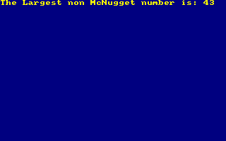](../../dist/index.html?database=apps&example=rosetta/mcnugget)

Taken from [Rosetta Code: McNuggets problem](https://rosettacode.org/wiki/McNuggets_problem#Locomotive_Basic).

### metronom - Metronome {#metronom}

[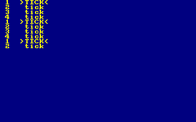](../../dist/index.html?database=apps&example=rosetta/metronom)

Taken from [Rosetta Code: Metronome](https://rosettacode.org/wiki/Metronome#Locomotive_Basic).

### mineswee - Minesweeper game {#mineswee}

[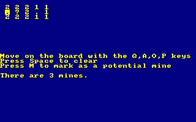](../../dist/index.html?database=apps&example=rosetta/mineswee)

Taken from [Rosetta Code: Minesweeper game](https://rosettacode.org/wiki/Minesweeper_game#Locomotive_Basic).

(to be continued)

### **mv, 03/2025**
