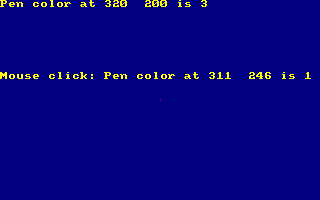

# CPCBasic Rosetta Code Collection

[CPCBasicApps](https://benchmarko.github.io/CPCBasicApps/) is a collection of CPC BASIC apps.
They can be run on a Amstrad CPC 464/664/6128, in an emulator or with
[CPCBasic](https://benchmarko.github.io/CPCBasic/) or [CPCBasicTS](https://benchmarko.github.io/CPCBasicTS/).

Links:
[Source code](https://github.com/benchmarko/CPCBasicApps/),
[HTML Readme](https://github.com/benchmarko/CPCBasicApps/#readme),

## Some Rosetta Code Highlights

[Rosetta Code](https://rosettacode.org/) is a programming chrestomathy site.
It has coding examples for many programming languages including [Locomotive_Basic](https://rosettacode.org/wiki/Category:Locomotive_Basic).
The examples from Rosetta Code are are available under the GNU Free Documentation License,
version 1.2: [GNU FDL 1.2](https://www.gnu.org/licenses/fdl-1.2.html),
see also [Rosetta_Code: Copyrights](https://rosettacode.org/wiki/Rosetta_Code:Copyrights).

### 24game - The 24 Game {#the24game}

Taken from [Rosetta Code: The 24 Game](https://rosettacode.org/wiki/24_game#Locomotive_Basic).

### abelian - Abelian sandpile model {#abelian}

Taken from [Rosetta Code: Abelian sandpile model](https://rosettacode.org/wiki/Abelian_sandpile_model#Locomotive_Basic).

### animate - Animate a pendulum {#animate}

Taken from [Rosetta Code: Animate a pendulum](https://rosettacode.org/wiki/Animate_a_pendulum#Locomotive_Basic).

### archimed - Archimedean spiral {#archimed}

Taken from [Rosetta Code: Archimedean spiral](https://rosettacode.org/wiki/Archimedean_spiral#Locomotive_Basic).

### audiofre - Audio frequency generator {#audiofre}

Taken from [Rosetta Code: Audio frequency generator](https://rosettacode.org/wiki/Audio_frequency_generator#Locomotive_Basic).

### barnsley - Barnsley fern {#barnsley}

Taken from [Rosetta Code: Barnsley fern](https://rosettacode.org/wiki/Barnsley_fern#Locomotive_Basic).

### binary - Binary digits {#binary}

Taken from [Rosetta Code: Binary digits](https://rosettacode.org/wiki/Binary_digits#Locomotive_Basic).

### biorhyth - Biorhythms {#biorhyth}

Taken from [Rosetta Code: Biorhythms](https://rosettacode.org/wiki/Biorhythms#Locomotive_Basic).

### brownian - Brownian tree {#brownian}

Taken from [Rosetta Code: Brownian tree](https://rosettacode.org/wiki/Brownian_tree#Locomotive_Basic).

### callfor - Call a foreign-language function {#callfor}

Taken from [Rosetta Code: Call a foreign-language function](https://rosettacode.org/wiki/Call_a_foreign-language_function#Locomotive_Basic).

### chaos - Chaos game {#chaos}

Taken from [Rosetta Code: Chaos game](https://rosettacode.org/wiki/Chaos_game#Locomotive_Basic).

### colorbar - Colour bars/Display {#colorbar}

Taken from [Rosetta Code: Colour bars/Display](https://rosettacode.org/wiki/Colour_bars/Display#Locomotive_Basic).

### colorscr - Color of a screen pixel {#colorscr}

Taken from [Rosetta Code: Color of a screen pixel](https://rosettacode.org/wiki/Color_of_a_screen_pixel#Locomotive_Basic).

### constrpo - Constrained random points on a circle {#constrpo}

Taken from [Rosetta Code: Constrained random points on a circle](https://rosettacode.org/wiki/Constrained_random_points_on_a_circle#Locomotive_Basic).

### deletefi - Delete a file {#deletefi}

Taken from [Rosetta Code: Delete a file](https://rosettacode.org/wiki/Delete_a_file#Locomotive_Basic).

### detectdi - Detect division by zero {#detectdi}

Taken from [Rosetta Code: Detect division by zero](https://rosettacode.org/wiki/Detect_division_by_zero#Locomotive_Basic).

### drawclk - Draw a clock {#drawclk}

Taken from [Rosetta Code: Draw a clock](https://rosettacode.org/wiki/Draw_a_clock#Locomotive_Basic).

### drawcub - Draw a cuboid {#drawcub}

Taken from [Rosetta Code:  Draw a cuboid](https://rosettacode.org/wiki/Draw_a_cuboid#Locomotive_Basic).

### drawsp - Draw a sphere (ASCII) {#drawsp}

Taken from [Rosetta Code: Draw a sphere](https://rosettacode.org/wiki/Draw_a_sphere#Locomotive_Basic).

### drawsp2 - Draw a sphere {#drawsp2}

Taken from [Rosetta Code: Draw a sphere](https://rosettacode.org/wiki/Draw_a_sphere#Locomotive_Basic).

### ethiopia - Ethiopian multiplication {#ethiopia}

Taken from [Rosetta Code: Ethiopian multiplication](https://rosettacode.org/wiki/Ethiopian_multiplication#Locomotive_Basic).

### execute - Execute a system command {#execute}

Taken from [Rosetta Code: Execute a system command](https://rosettacode.org/wiki/Execute_a_system_command#Locomotive_Basic).

### forest - Forest fire {#forest}

Taken from [Rosetta Code: Forest fire](https://rosettacode.org/wiki/Forest_fire#Locomotive_Basic).

### function - Function definition {#function}

Taken from [Rosetta Code: Function definition](https://rosettacode.org/wiki/Function_definition#Locomotive_Basic).

### gofish - Go Fish {#gofish}

Taken from [Rosetta Code: Go Fish](https://rosettacode.org/wiki/Go_Fish#Locomotive_Basic).

### guessnfb - Guess the number with feedback {#guessnfb}

Taken from [Rosetta Code: Guess the number with feedback](https://rosettacode.org/wiki/Guess_the_number/With_feedback#Locomotive_Basic).

### guessnum - Guess the number {#guessnum}

Taken from [Rosetta Code: Guess the number](https://rosettacode.org/wiki/Guess_the_number#Locomotive_Basic).

### happynum - Happy numbers {#happynum}

Taken from [Rosetta Code: Happy numbers](https://rosettacode.org/wiki/Happy_numbers#Locomotive_Basic).

### hellolp - Hello world (Line printer) {#hellolp}

Taken from [Rosetta Code: Hello world (Line printer)](https://rosettacode.org/wiki/Hello_world/Line_printer#Locomotive_Basic).

### hellonb - Hello world (Newbie) {#hellonb}

Taken from [Rosetta Code: Hello world (Newbie)](https://rosettacode.org/wiki/Hello_world/Newbie#Locomotive_Basic).

### introspe - Introspection {#introspe}

Taken from [Rosetta Code: Introspection](https://rosettacode.org/wiki/Introspection#Locomotive_Basic).

### joystick - Joystick position {#joystick}

Taken from [Rosetta Code: Joystick position](https://rosettacode.org/wiki/Joystick_position#Locomotive_Basic).

### juliaset - Julia set {#juliaset}

Taken from [Rosetta Code: Julia set](https://rosettacode.org/wiki/Julia_set#Locomotive_Basic).

### keybofl - Keyboard input: Flush the keyboard buffer {#keybofl}

Taken from [Rosetta Code: Keyboard input: Flush the keyboard buffer](https://rosettacode.org/wiki/Keyboard_input/Flush_the_keyboard_buffer#Locomotive_Basic).

### keyboyn - Keyboard input: Obtain a Y or N response {#keyboyn}

Taken from [Rosetta Code: Keyboard input: Obtain a Y or N response](https://rosettacode.org/wiki/Keyboard_input/Obtain_a_Y_or_N_response#Locomotive_Basic).

### knights - Knight's tour {#knights}

Taken from [Rosetta Code: Knight's tour](https://rosettacode.org/wiki/Knight%27s_tour#Locomotive_Basic).

### langtons - Langton's ant {#langtons}

Taken from [Rosetta Code: Langton's ant](https://rosettacode.org/wiki/Langton%27s_ant#Locomotive_Basic).

### magic8 - Magic 8-ball {#magic8}

Taken from [Rosetta Code: Magic 8-ball](https://rosettacode.org/wiki/Magic_8-ball#Locomotive_Basic).

### makeback - Make a backup file {#makeback}

Taken from [Rosetta Code: Make a backup file](https://rosettacode.org/wiki/Make_a_backup_file#Locomotive_Basic).

### mandelbr - Mandelbrot set {#mandelbr}

Taken from [Rosetta Code: Mandelbrot set](https://rosettacode.org/wiki/Mandelbrot_set#Locomotive_Basic).

### matrixra - Matrix digital rain {#matrixra}

Taken from [Rosetta Code: Matrix digital rain](https://rosettacode.org/wiki/Matrix_digital_rain#Locomotive_Basic).

### mcnugget - McNuggets problem {#mcnugget}

Taken from [Rosetta Code: McNuggets problem](https://rosettacode.org/wiki/McNuggets_problem#Locomotive_Basic).

### metronom - Metronome {#metronom}

Taken from [Rosetta Code: Metronome](https://rosettacode.org/wiki/Metronome#Locomotive_Basic).

### mineswee - Minesweeper game {#mineswee}

Taken from [Rosetta Code: Minesweeper game](https://rosettacode.org/wiki/Minesweeper_game#Locomotive_Basic).

### montecar - Monte Carlo methods {#montecar}

Taken from [Rosetta Code: Monte Carlo methods](https://rosettacode.org/wiki/Monte_Carlo_methods#Locomotive_Basic).

### musscale - Musical scale {#musscale}

Taken from [Rosetta Code: Musical scale](https://rosettacode.org/wiki/Musical_scale#Locomotive_Basic).

### nqueens - N-queens problem {#nqueens}

Taken from [Rosetta Code: N-queens problem](https://rosettacode.org/wiki/N-queens_problem#Locomotive_Basic).

### nondecra - Non-decimal radices {#nondecra}

Taken from [Rosetta Code: Non-decimal radices](https://rosettacode.org/wiki/Non-decimal_radices/Output#Locomotive_Basic).

### onedimca - One-dimensional cellular automata {#onedimca}

Taken from [Rosetta Code: One-dimensional cellular automata](https://rosettacode.org/wiki/One-dimensional_cellular_automata#Locomotive_Basic).

### pascaltr - Pascal's triangle {#pascaltr}

Taken from [Rosetta Code: Pascal's triangle](https://rosettacode.org/wiki/Pascal%27s_triangle#Locomotive_Basic).

### pinstrip - Pinstripe: Display {#pinstrip}

Taken from [Rosetta Code: Pinstripe: Display](https://rosettacode.org/wiki/Pinstripe/Display#Locomotive_Basic).

### progterm - Program termination {#progterm}

Taken from [Rosetta Code: Program termination](https://rosettacode.org/wiki/Program_termination#Locomotive_Basic).

### rainbow - Rainbow {#rainbow}

Taken from [Rosetta Code: Rainbow](https://rosettacode.org/wiki/Rainbow#Locomotive_Basic).

### random - Random number generator (included) {#random}

No code.

See: [Rosetta Code: Random number generator (included)](https://rosettacode.org/wiki/Random_number_generator_(included)#Locomotive_Basic).

### readfile - Read a file line by line {#readfile}

Taken from [Rosetta Code: Read a file line by line](https://rosettacode.org/wiki/Read_a_file_line_by_line#Locomotive_Basic).

### renfile - Rename a file {#renfile}

Taken from [Rosetta Code: Rename a file](https://rosettacode.org/wiki/Rename_a_file#Locomotive_Basic).

### rockpap - Rock-paper-scissors {#rockpap}

Taken from [Rosetta Code: Rock-paper-scissors](https://rosettacode.org/wiki/Rock-paper-scissors#Locomotive_Basic).

### rot13 - Rot-13 {#rot13}

Taken from [Rosetta Code: Rot-13](https://rosettacode.org/wiki/Rot-13#Locomotive_Basic).

### showasc - Show ASCII table {#showasc}

Taken from [Rosetta Code: Show ASCII table](https://rosettacode.org/wiki/Show_ASCII_table#Locomotive_Basic).

### sieveera - Sieve of Eratosthenes {#sieveera}

Taken from [Rosetta Code: Sieve of Eratosthenes](https://rosettacode.org/wiki/Sieve_of_Eratosthenes#Locomotive_Basic).

### snake - Snake {#snake}

Taken from [Rosetta Code: Snake](https://rosettacode.org/wiki/Snake#Locomotive_Basic).

### speech - Speech synthesis {#speech}

Taken from [Rosetta Code: Speech synthesis](https://rosettacode.org/wiki/Speech_synthesis#Locomotive_Basic).

### substr - Substring: Top and tail {#substr}

Taken from [Rosetta Code: Substring: Top and tail](https://rosettacode.org/wiki/Substring/Top_and_tail#Locomotive_Basic).

### systime - System time {#systime}

Taken from [Rosetta Code: System time](https://rosettacode.org/wiki/System_time#Locomotive_Basic).

### termct1 - Terminal control: Coloured text {#termct1}

Taken from [Rosetta Code: Terminal control: Coloured text](https://rosettacode.org/wiki/Terminal_control/Coloured_text#Locomotive_Basic).

### termct2 - Terminal control: Cursor positioning {#termct2}

Taken from [Rosetta Code: Terminal control: Cursor positioning](https://rosettacode.org/wiki/Terminal_control/Cursor_positioning#Locomotive_Basic).

### termct3 - Terminal control: Dimensions {#termct3}

Taken from [Rosetta Code: Terminal control: Dimensions](https://rosettacode.org/wiki/Terminal_control/Dimensions#Locomotive_Basic).

### termct4 - Terminal control: Display an extended character {#termct4}

Taken from [Rosetta Code: Terminal control: Display an extended character](https://rosettacode.org/wiki/Terminal_control/Display_an_extended_character#Locomotive_Basic).

### termct5 - Terminal control: Hiding the cursor {#termct5}

Taken from [Rosetta Code: Terminal control: Hiding the cursor](https://rosettacode.org/wiki/Terminal_control/Hiding_the_cursor#Locomotive_Basic).

### termct6 - Terminal control: Inverse video {#termct6}

Taken from [Rosetta Code: Terminal control: Inverse video](https://rosettacode.org/wiki/Terminal_control/Inverse_video#Locomotive_Basic).

### termct7 - Terminal control: Positional read {#termct7}

Taken from [Rosetta Code: Terminal control: Positional read](https://rosettacode.org/wiki/Terminal_control/Positional_read#Locomotive_Basic).

### termct8 - Terminal control: Ringing the terminal bell {#termct8}

Taken from [Rosetta Code: Terminal control: Ringing the terminal bell](https://rosettacode.org/wiki/Terminal_control/Ringing_the_terminal_bell#Locomotive_Basic).

### unicode - Unicode strings {#unicode}

Taken from [Rosetta Code: Unicode strings](https://rosettacode.org/wiki/Unicode_strings#Locomotive_Basic).

### videomod - Video display modes {#videomod}

Taken from [Rosetta Code: Video display modes](https://rosettacode.org/wiki/Video_display_modes#Locomotive_Basic).

### write3d - Write language name in 3D ASCII {#write3d}

Taken from [Rosetta Code: Write language name in 3D ASCII](https://rosettacode.org/wiki/Write_language_name_in_3D_ASCII#Locomotive_Basic).

### yinyang - Yin and yang {#yinyang}

Taken from [Rosetta Code: Yin and yang](https://rosettacode.org/wiki/Yin_and_yang#Locomotive_Basic).

### zeropow - Zero to the zero power {#zeropow}

Taken from [Rosetta Code: Zero to the zero power](https://rosettacode.org/wiki/Zero_to_the_zero_power#Locomotive_Basic).

### **mv, 03/2025**
